| Group Member      | Student ID   |
| ----------------- | ------------ |
| Keegan Rolls      | 202004149    |
| Nicholas Philpott | 202018248    |

\pagebreak

## Geometric Transformation
<!-- TODO: Finish Q6 and update code -->
The code contained within this section can be found in it's entirety in [Appendix A](#appendix-a)

1. *Download the test image (im1.png) from Brightspace under Lab 01. Read the image, convert the image to a grayscale image, and display the image.*

    ```m
    imc = imread("./im1.png");

    img = rgb2gray(imc);

    imshow(img);
    title('Image in grayscale');
    ```

    {#1 width=50%}

2.
    a. *Define the transormation matrix with a rotation angle of 45 degrees*

        ```m
        function [R] = rotation_matrix(theta)
            % Create a rotation matrix for a given angle in radians
            R = [cos(theta) -sin(theta) 0;
                sin(theta) cos(theta) 0;
                0 0 1];
        end

        rot_img_45 = rotate_image(img, rotation_matrix(pi / 4));
        ```

    b. *Calculate the size of the transformed image and generate an empty image with the calculated size*

        ```m
        function [rot_img] = rotate_image(img, R)
            % Rotate image `img` using the transformation matrix `R`
            [y_max, x_max] = size(img);
            corners = [0, 0, 1;
                    x_max, 0, 1;
                    0, y_max, 1;
                    x_max, y_max, 1]; % Corner points of the image

            new_corners = corners * R; % New location of corners
            new_width = round(max(new_corners(:, 1)) - min(new_corners(:, 1)));
            new_height = round(max(new_corners(:, 2)) - min(new_corners(:, 2)));
            min_width = abs(min(new_corners(:, 1)));
            min_height = abs(min(new_corners(:, 2)));
            min_width = round(min_width) + 1;
            min_height = round(min_height) + 1;

            rot_img = zeros(new_height, new_width);
        ```

    c. *Transform each pixel of the original image with the transformation matrix and assign the intensity to the new location.*

        ```m
            for i = 1:y_max
                for j = 1:x_max
                    temp = ([j - 1, i - 1, 1]) * R;
                    x_new = round(temp(1, 1)) + min_width;
                    y_new = round(temp(1, 2)) + min_height;
                    rot_img(y_new, x_new) = img(i, j);
                end
            end

            % convert to uint8 for display
            rot_img = uint8(rot_img);
        end
        ```

    d. *View the transformed image.*

        See [Figure 2](#2) below

        ```m
        figure;
        subplot(1, 3, 1);
        imshow(rot_img_45, []);
        title('Rotated image by 45 degrees');
        ```

        {#2 width=50%}

3. *Complete the steps above (Q2.a - 2.d) for angle $\theta=90^\circ$.*

    See [Figure 3](#3) below.

    {#3 width=50%}

    ```m
    rot_img_90 = rotate_image(img, rotation_matrix(pi / 2));

    ...

    subplot(1, 3, 2);
    imshow(rot_img_90, []);
    title('Rotated image by 90 degrees');
    ```

4. *Complete the steps above (Q2.a - 2.d) for angle $\theta=-25^\circ$.*

    See [Figure 4](#4) below.

    {#4 width=50%}

    ```m
    rot_img_25 = rotate_image(img, rotation_matrix((-25) * (pi / 180)));

    ...

    subplot(1, 3, 3);
    imshow(rot_img_25, []);
    title('Rotated image by -25 degrees');
    ```

5. *It can be seen that in some cases, when the image is transformed the output image has ‘empty’ black pixels. Explain why this happens in only some images, but not others.*

    A digital image is comprised of a discrete of coordinates such that when a picture has some geometric transformation done to it and the pixels are mapped to new values, if these values are not integers, the new pixel will default to black.  

6. *In the previous questions, we defined the size of the output image and mapped each input pixel to the corresponding output pixel. We can improve the output image, ensuring no ‘black’ or ‘empty’ pixels by first calculating the size of the transformed image, generating an empty image of the correct output size, and then calculate the inverse of the forward transformation matrix. For each pixel of the transformed output image, we use the inverse transformation to search backwards in the input image for the correct pixel. In this way, every pixel in the output image will find an input pixel. If the corresponding pixel in the input image is outside image boundary, we can simply set the value of the output pixel to zero*

    a. *Calculate the inverse transformation matrix.*

        $$
        R = \begin{bmatrix}
        \cos\theta & \sin\theta & 0 \\
        -\sin\theta & \cos\theta & 0 \\
        0 & 0 & 1
        \end{bmatrix}
        \quad \quad
        R^{-1} = \begin{bmatrix}
        \cos\theta & -\sin\theta & 0 \\
        \sin\theta & \cos\theta & 0 \\
        0 & 0 & 1
        \end{bmatrix}
        $$    
        
        For a rotation matrix, the inverse is equal to its transpose. This is because rotation matrices are orthogonal matrices, where $R^{-1} = R^T$.

    b. *Modify the code in Q2 to calculate the following inverse transformation, and use it to iterate through each output image pixel to search the input image for the following transformations. Visualize your results.*

        ```m
        function [new_image] = transform_image_inverse(img, T)
            % Transform image using inverse transformation mapping
            [y_max, x_max] = size(img);

            % Calculate corners of original image
            corners = [0, 0, 1;
                    x_max, 0, 1;
                    0, y_max, 1;
                    x_max, y_max, 1];

            % Transform corners to find output image size
            new_corners = corners * T;
            new_width = round(max(new_corners(:, 1)) - min(new_corners(:, 1)));
            new_height = round(max(new_corners(:, 2)) - min(new_corners(:, 2)));
            min_width = abs(min(new_corners(:, 1)));
            min_height = abs(min(new_corners(:, 2)));
            min_width = round(min_width) + 1;
            min_height = round(min_height) + 1;

            % Initialize output image
            new_image = zeros(new_height, new_width);

            % Invert transformation matrix
            T_inv = inv(T);

            % For each pixel in output image, find corresponding input pixel
            for i = 1:new_height
                for j = 1:new_width
                    % Map output coordinates back to input coordinates
                    output_coords = [j - min_width, i - min_height, 1];
                    input_coords = output_coords * T_inv;

                    x_orig = round(input_coords(1)) + 1;
                    y_orig = round(input_coords(2)) + 1;

                    % Check if coordinates are within input image bounds
                    if (x_orig >= 1 && x_orig <= x_max) && (y_orig >= 1 && y_orig <= y_max)
                        new_image(i, j) = img(y_orig, x_orig);
                    else
                        new_image(i, j) = 0; % Assign zero if out of bounds
                    end
                end
            end

            % Convert to uint8 for display
            new_image = uint8(new_image);
        end
        ```

        1. Translation $\left( t_x = 50, t_y = 45 \right)$

            See [Figure 5](#5) Below

            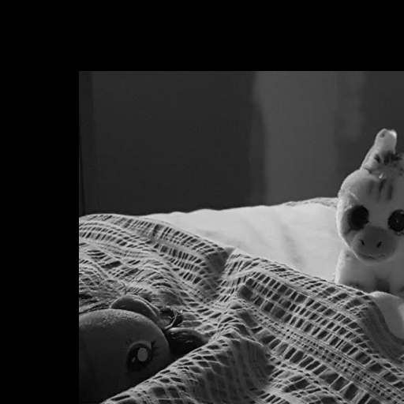{#5 width=50%}

        2. Scale $\left(c_x = 0.5, c_y = 1.5\right)$

            See [Figure 6](#6) Below

            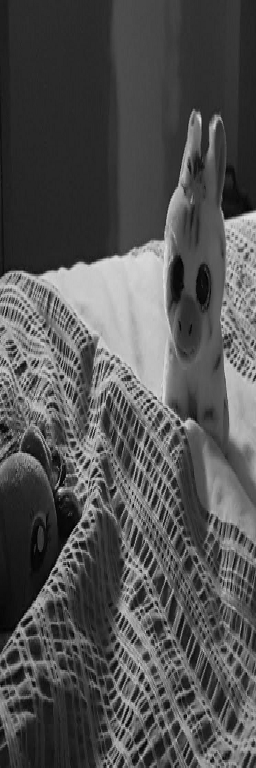{#6 width=50%}
        
        3. Shear (vertical) $\left(s_v = 0.2\right)$
            
            See [Figure 7](#7) Below

            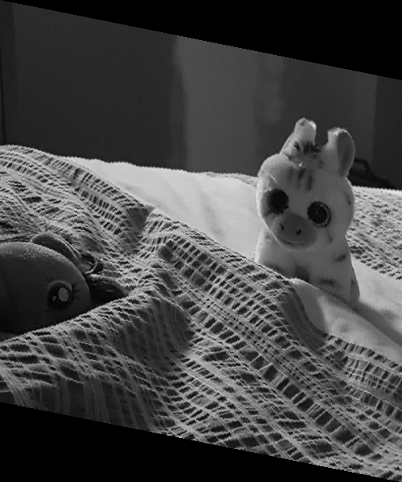{#7 width=50%}

        4. Shear (horizontal) $\left(s_v = 0.3\right)$
            
            See [Figure 8](#8) Below

            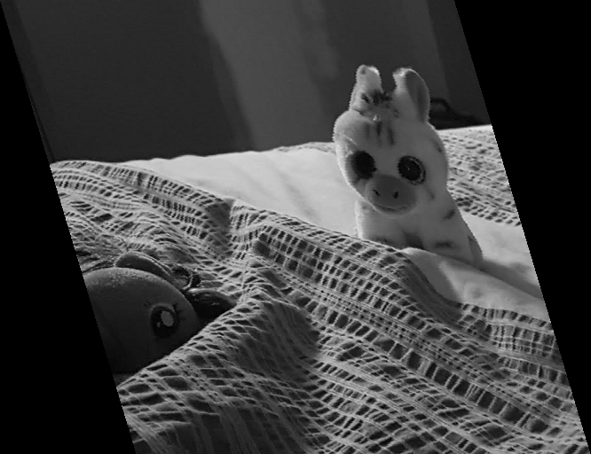{#8 width=50%}

        5. Rotation $\left(\theta = 50^\circ\right)$ followed by translation $\left( t_x = 25, t_y = 30 \right)$

            See [Figure 9](#9) Below

            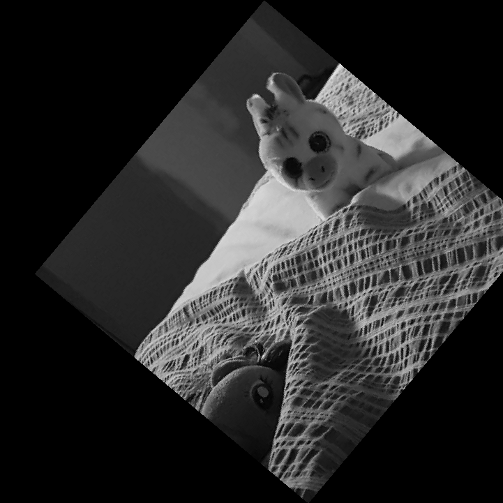{#9 width=50%}

\pagebreak

## Histogram Equalization
<!-- TODO: Insert finished code -->
The code contained within this section can be found in it's entirety in [Appendix B](#appendix-b)

1. *Download the test image (im2.png) from Brightspace under Lab 01. Read the image, convert the image to a grayscale image, and visualize it.*

    The below code was used to create [Figure 10](#img2Grey)

    ```m
    imc = imread('im2.png');% Read the image
    img = rgb2gray(imc); % Convert to grayscale
    imshow(img); % View image
    ```

    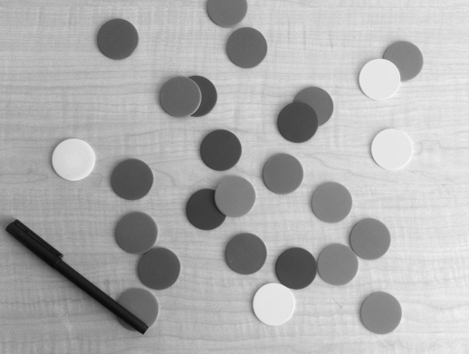{#img2Grey width=50%}

2. *Grayscale images have 256 gray levels. Therefore create an empty matrix having dimensions of $1\times256$, generate the histogram and display it.*

    The below code was used to create [Figure 11](#histOrig)

    ```m
    H = size(img,1); % Read the height of the image
    W = size(img,2); % Read the width of the image

    Hist_arr = zeros(1,256); % Array for holding the (original) histogram
    Hist_eq_arr = zeros(1,256); % Array for holding the (equalized) histogram

    CDF_array = zeros(1,length(Hist_arr)); % array to hold cumulative distribution function (CDF)

    hist_eq_img = uint8(zeros(H,W)); % A 2D array for keeping histogram equalized image (intensity in 8 bit integers)

    for i=1:H,
        for j=1:W,
            Hist_arr(1,img(i,j)+1)=Hist_arr (1,img(i,j)+1)+1 ;
        end
    end

    figure;
    bar(Hist_arr);
    title('Histogram of Original Image');
    ```

    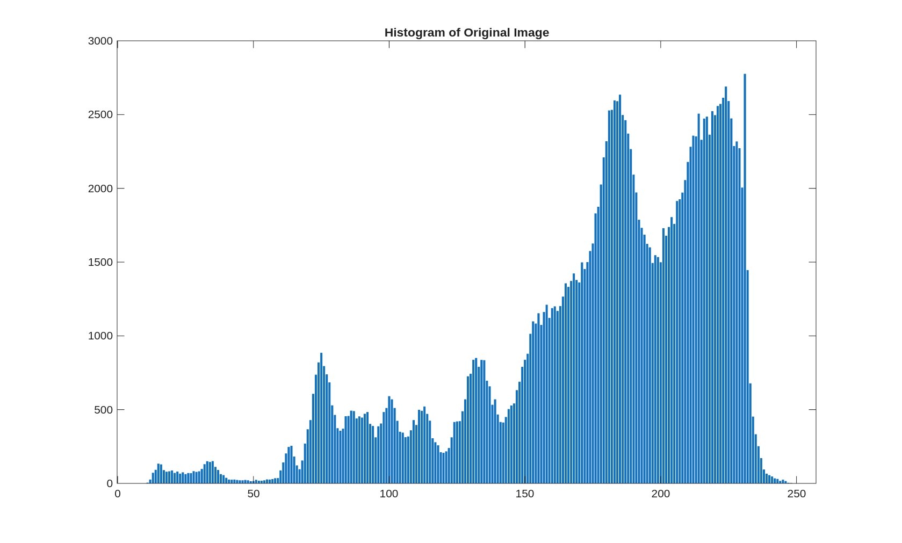{#histOrig}

3. *Calculate $p_r\left(r_k\right)$ for the image and display it. (Total number of pixels $= y_{max}\times x_{max}$).*

    The below code was used to create [Figure 12](#pdfOrig)

    ```m
    Hist_arr_pdf = Hist_arr/(H*W); % PDF

    figure;
    plot(0:255, Hist_arr_pdf, 'r-');
    xlabel('Gray Level');
    ylabel('Probability Density Function (PDF)');
    grid on;
    axis([0 255 0 max(Hist_arr_pdf)*1.1]);
    title('PDF of Original Image');
    ```

    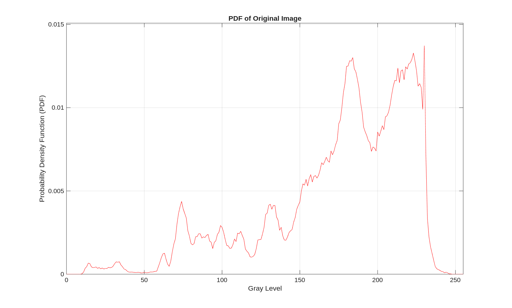{#pdfOrig}

4. *Calculate the CDF from the PDF, and display it.*

    The below code was used to create [Figure 13](#cdfOrig)

    ```m
    dummy1=0; % A dummy variable to hold the summation results

    for k=1:length(Hist_arr); % Generating the CDF from PDF
        dummy1=dummy1+Hist_arr_pdf(k);
        CDF_array(k)= dummy1;
    end

    figure;
    plot(0:255, CDF_array, 'b-');
    title('CDF of Original Image');
    xlabel('Gray Level');
    ylabel('Cumulative Probability');
    grid on;
    ```

    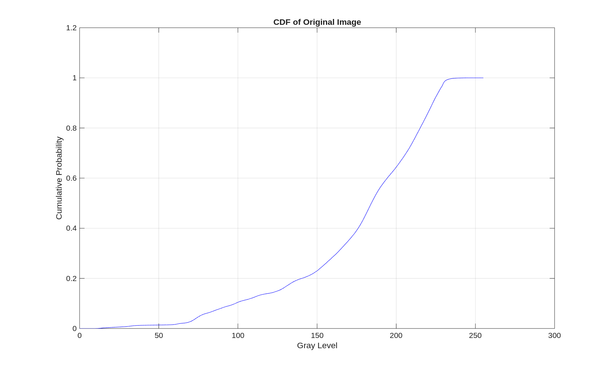{#cdfOrig}

5. *Calculate the equalized histogram using equation 1 and map the original gray levels to the new gray levels. Display the original and new values.*

    The below code was used to create [Figure 14](#mapping)

    ```m
    for l=1:H, % Histogram equalization
        for m=1:W,
            hist_eq_img(l,m)= round(CDF_array(img(l,m)+1)*(length(Hist_arr_pdf)-1)); % scale to 255 and round to nearest integer
            Hist_eq_arr(1, hist_eq_img(l,m)+1)=Hist_eq_arr (1,hist_eq_img(l,m)+1)+1; % Its histogram
        end

    end

    % Display the histogram of equalized image
    figure;
    subplot(2,1,1);
    bar(Hist_eq_arr);
    title('Histogram of Equalized Image');

    % Create a mapping table showing original gray levels and their new values
    mapping = zeros(1, 256);
    for i = 1:256
        mapping(i) = round(CDF_array(i) * 255);
    end

    % Display the mapping
    subplot(2,1,2);
    plot(0:255, mapping, 'r-', 0:255, 0:255, 'b--');
    title('Mapping from Original to Equalized Gray Levels');
    xlabel('Original Gray Level');
    ylabel('New Gray Level');
    legend('Equalization Mapping', 'Identity Line');
    grid on;
    ```

    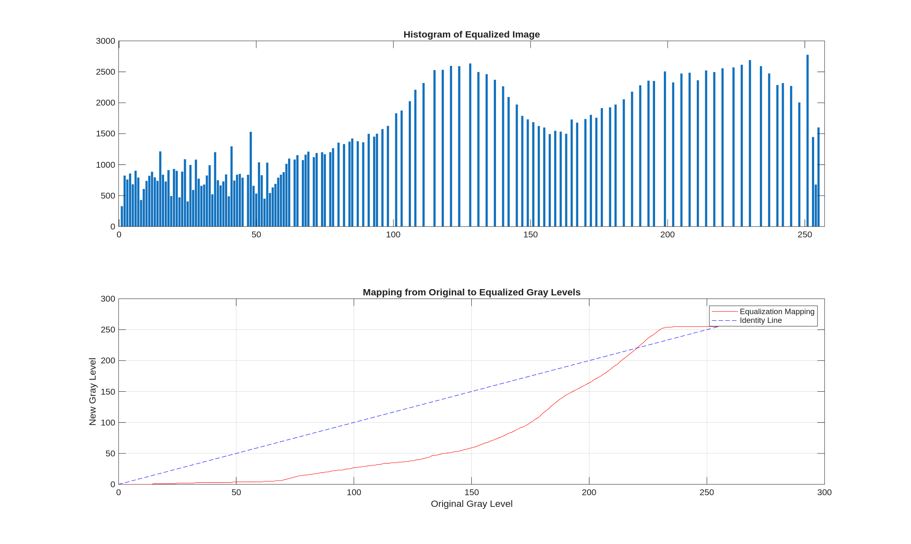{#mapping}

6. *Display both images, before (original) and after histogram equilization*

    The below code was used to create [Figure 15](#equalized)

    ```m
    % Display the equalized image
    figure;
    subplot(1, 2, 1);
    imshow(img);
    title('Original Image');
    subplot(1, 2, 2);
    imshow(hist_eq_img);
    title('Histogram Equalized Image');
    ```

    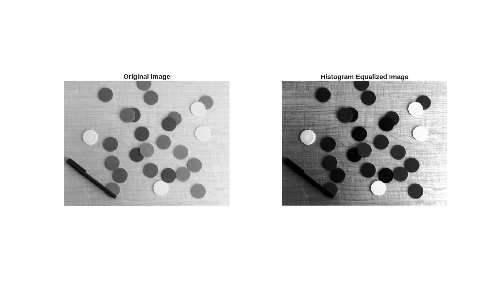{#equalized}

\pagebreak

## Performance Evaluation
<!-- TODO: Finish the question -->
The code contained within this section can be found in it's entirety in [Appendix C](#appendix-c)

1. *Download or use any image that is larger than 640×640 pixels and use your code to rotate the image by 90 degrees. Use the inbuilt functions (e.g., maketform and imtransform in MATLAB Image Processing Toolbox) to perform the rotation of the same image. Comment on the difference in speed between the two approaches.*

    [Figure 16](#inbuilt) below shows the selected image ("im3.png") of a digital camera on a yellow background in the first quadrant. It has dimensions $3196\times3196$.

    The following code shows that the image is loaded and converted to greyscale before defining the rotation matrix.

    ```m
    % Load the image
    imc = imread("./L1/im3.png");

    % Convert to grayscale
    img = rgb2gray(imc);

    % Rotate the image by 90 degrees
    theta = pi/2;

    % Transformation matrix for rotation
    R = [cos(theta) sin(theta) 0;
        -sin(theta) cos(theta) 0;
        0           0          1];
    ```

    Using the same method as in [Question 1](#geometric-transformation), a function `rotate_image` is defined. The function `rotate_image` is then timed.

    ```m
    function [rot_img] = rotate_image(img, R)
        % Rotate image `img` using the transformation matrix `R`
        [y_max, x_max] = size(img);
        fprintf('Image size: %d x %d\n', y_max, x_max);
        corners = [0, 0, 1;
            x_max, 0, 1;
            0, y_max, 1;
            x_max, y_max, 1]; % Corner points of the image

        new_corners = corners * R; % New location of corners
        new_width = round(max(new_corners(:, 1)) - min(new_corners(:, 1)));
        new_height = round(max(new_corners(:, 2)) - min(new_corners(:, 2)));
        min_width = abs(min(new_corners(:, 1)));
        min_height = abs(min(new_corners(:, 2)));
        min_width = round(min_width) + 1;
        min_height = round(min_height) + 1;

        rot_img = zeros(new_height, new_width);
        for i = 1:y_max
            for j = 1:x_max
                temp = ([j - 1, i - 1, 1]) * R;
                x_new = round(temp(1, 1)) + min_width;
                y_new = round(temp(1, 2)) + min_height;
                rot_img(y_new, x_new) = img(i, j);
            end
        end

    end

    tic; % Start timing
    rot_img_custom = rotate_image(img, R);
    custom_time = toc;
    ```

    Next, the same operation is performed using inbuilt functions `maketform` and `imtransform` and timed.

    ```m
    % Rotate the image by 90 degrees using inbuilt functions
    tic; % Start timing
    % Create the transformation matrix using maketform
    tform = maketform('affine', R);
    % Apply the transformation using imtransform
    rot_img_inbuilt = imtransform(img, tform);
    inbuilt_time = toc; % End timing
    ```

    Finally, [Figure 16](#inbuilt) below was generated. As shown in [Figure 16](#inbuilt), the custom rotation implementation took significantly longer than using MATLAB's built-in functions. The custom implementation required iterating through each pixel individually, resulting in execution time of several seconds, while the built-in functions completed the same operation much faster due to their optimized implementation. This demonstrates the efficiency advantage of using specialized library functions for image processing tasks.

    {#inbuilt}

2. *Comment on the shape of the histogram resulting from the histogram equalization process. Is it a perfectly uniform histogram, like we would theoretically expect? Provide an explanation of why it is, or is not, uniform.*

    Using the same method as [Question 2](#histogram-equalization), "im3.png" was equalized. The below code demonstrates this process.

    ```m
    H = size(img,1); % Read the height of the image
    W = size(img,2); % Read the width of the image

    Hist_arr = zeros(1,256); % Array for holding the (original) histogram
    Hist_eq_arr = zeros(1,256); % Array for holding the (equalized) histogram

    CDF_array = zeros(1,length(Hist_arr)); % array to hold cumulative distribution function (CDF)

    hist_eq_img = uint8(zeros(H,W)); % A 2D array for keeping histogram equalized image (intensity in 8 bit integers)

    for i=1:H,
        for j=1:W,
            Hist_arr(1,img(i,j)+1)=Hist_arr (1,img(i,j)+1)+1 ;
        end
    end

    Hist_arr_pdf = Hist_arr/(H*W); % PDF

    dummy1=0; % A dummy variable to hold the summation results
    for k=1:length(Hist_arr); % Generating the CDF from PDF
        dummy1=dummy1+Hist_arr_pdf(k);
        CDF_array(k)= dummy1;
    end

    for l=1:H, % Histogram equalization
        for m=1:W,
            hist_eq_img(l,m)= round(CDF_array(img(l,m)+1)*(length(Hist_arr_pdf)-1)); % scale to 255 and round to nearest integer
            Hist_eq_arr(1, hist_eq_img(l,m)+1)=Hist_eq_arr (1,hist_eq_img(l,m)+1)+1; % Its histogram
        end
    end
    ```

    Next, [Figure 17](#hist2) was generated. The histogram resulting from the equalization process is not perfectly uniform due to several practical constraints. Digital images use discrete intensity levels (0-255 in 8-bit images), which inherently limits how evenly pixels can be redistributed, resulting in distinct spikes rather than a smooth distribution. The gaps between these spikes occur because multiple input intensity values must map to the same output value during transformation. Additionally, the original histogram shows most pixel values clustered in the higher intensity range (around 200); when redistributed, these pixels maintain their relative ordering, contributing to the non-uniformity. The discrete nature of the cumulative distribution function used in histogram equalization imposes quantization constraints that prevent perfect uniformity. Despite these limitations, the equalized histogram demonstrates significantly better utilization of the full intensity range compared to the original, with values distributed across the entire spectrum rather than concentrated in one region, which explains the improved contrast in the equalized image.

    {#hist2}

\pagebreak

## Appendix A

The below code is the complete code used in [Question 1](#geometric-transformation). It is also included in this submission as `question1.m`.

```m
imc = imread("~/_MUN/ECE-7410/labs/L1/im1.png");

img = rgb2gray(imc);

% Ensure directory exists
if ~exist('./L1/report', 'dir')
    mkdir('./L1/report');
end

imwrite(img, './L1/report/img1_grey.png');

function [rot_img] = rotate_image(img, R)
    % Rotate image `img` using the transformation matrix `R`
    [y_max, x_max] = size(img);
    corners = [0, 0, 1;
               x_max, 0, 1;
               0, y_max, 1;
               x_max, y_max, 1]; % Corner points of the image

    new_corners = corners * R; % New location of corners
    new_width = round(max(new_corners(:, 1)) - min(new_corners(:, 1)));
    new_height = round(max(new_corners(:, 2)) - min(new_corners(:, 2)));
    min_width = abs(min(new_corners(:, 1)));
    min_height = abs(min(new_corners(:, 2)));
    min_width = round(min_width) + 1;
    min_height = round(min_height) + 1;

    rot_img = zeros(new_height, new_width);

    for i = 1:y_max
        for j = 1:x_max
            temp = ([j - 1, i - 1, 1]) * R;
            x_new = round(temp(1, 1)) + min_width;
            y_new = round(temp(1, 2)) + min_height;
            rot_img(y_new, x_new) = img(i, j);
        end
    end

    % convert to uint8 for display
    rot_img = uint8(rot_img);
end

function [R] = rotation_matrix(theta)
    % Create a rotation matrix for a given angle in radians
    R = [cos(theta) -sin(theta) 0;
         sin(theta) cos(theta) 0;
         0 0 1];
end

rot_img_45 = rotate_image(img, rotation_matrix(pi / 4));
rot_img_90 = rotate_image(img, rotation_matrix(pi / 2));
rot_img_25 = rotate_image(img, rotation_matrix((-25) * (pi / 180)));

figure;
subplot(1, 3, 1);
imshow(rot_img_45, []);
title('Rotated image by 45 degrees');
imwrite(rot_img_45, './L1/report/img1_rotated_45.png', 'png');

subplot(1, 3, 2);
imshow(rot_img_90, []);
title('Rotated image by 90 degrees');
imwrite(rot_img_90, './L1/report/img1_rotated_90.png', 'png');

subplot(1, 3, 3);
imshow(rot_img_25, []);
title('Rotated image by -25 degrees');
imwrite(rot_img_25, './L1/report/img1_rotated_25.png', 'png');

function [new_image] = transform_image_inverse(img, T)
    % Transform image using inverse transformation mapping
    [y_max, x_max] = size(img);

    % Calculate corners of original image
    corners = [0, 0, 1;
               x_max, 0, 1;
               0, y_max, 1;
               x_max, y_max, 1];

    % Transform corners to find output image size
    new_corners = corners * T;
    new_width = round(max(new_corners(:, 1)) - min(new_corners(:, 1)));
    new_height = round(max(new_corners(:, 2)) - min(new_corners(:, 2)));
    min_width = abs(min(new_corners(:, 1)));
    min_height = abs(min(new_corners(:, 2)));
    min_width = round(min_width) + 1;
    min_height = round(min_height) + 1;

    % Initialize output image
    new_image = zeros(new_height, new_width);

    % Invert transformation matrix
    T_inv = inv(T);

    % For each pixel in output image, find corresponding input pixel
    for i = 1:new_height
        for j = 1:new_width
            % Map output coordinates back to input coordinates
            output_coords = [j - min_width, i - min_height, 1];
            input_coords = output_coords * T_inv;

            x_orig = round(input_coords(1)) + 1;
            y_orig = round(input_coords(2)) + 1;

            % Check if coordinates are within input image bounds
            if (x_orig >= 1 && x_orig <= x_max) && (y_orig >= 1 && y_orig <= y_max)
                new_image(i, j) = img(y_orig, x_orig);
            else
                new_image(i, j) = 0; % Assign zero if out of bounds
            end
        end
    end

    % Convert to uint8 for display
    new_image = uint8(new_image);
end

% Translation 50 pixels right and 45 pixels down
T_i = [1 0 0;
       0 1 0;
       50 45 1];

rot_img_i = transform_image_inverse(img, T_i);

% Scale by 0.5 in x-direction and 1.5 in y-direction
T_ii = [0.5 0 0;
        0 1.5 0;
        0 0 1];

rot_img_ii = transform_image_inverse(img, T_ii);

% Shear by 0.2 in vertical direction
T_iii = [1 0.2 0;
         0 1 0;
         0 0 1];

rot_img_iii = transform_image_inverse(img, T_iii);

% Shear by 0.3 in horizontal direction
T_iv = [1 0 0;
        0.3 1 0;
        0 0 1];

rot_img_iv = transform_image_inverse(img, T_iv);

% Rotation by 50 degrees followed by translation 25 pixels right and 30 pixels down
theta_v = 50 * (pi / 180); % Convert degrees to radians

T_v = rotation_matrix(theta_v) * [1 0 0;
                                  0 1 0;
                                  25 30 1];

rot_img_v = transform_image_inverse(img, T_v);

figure;
subplot(2, 3, 1);
imshow(rot_img_i, []);
title('Translation $\left( t_x = 50, t_y = 45 \right)$', 'Interpreter', 'latex');
imwrite(rot_img_i, './L1/report/img1_6_i.png', 'png');

subplot(2, 3, 2);
imshow(rot_img_ii, []);
title('Scale $\left(c_x = 0.5, c_y = 1.5\right)$', 'Interpreter', 'latex');
imwrite(rot_img_ii, './L1/report/img1_6_ii.png', 'png');

subplot(2, 3, 3);
imshow(rot_img_iii, []);
title('Shear (vertical) $\left(s_v = 0.2\right)$', 'Interpreter', 'latex');
imwrite(rot_img_iii, './L1/report/img1_6_iii.png', 'png');

subplot(2, 3, 4);
imshow(rot_img_iv, []);
title('Shear (horizontal) $\left(s_v = 0.3\right)$', 'Interpreter', 'latex');
imwrite(rot_img_iv, './L1/report/img1_6_iv.png', 'png');

subplot(2, 3, 5);
imshow(rot_img_v, []);
title('Rotation $\left(\theta = 50^\circ\right)$ followed by translation $\left( t_x = 25, t_y = 30 \right)$', 'Interpreter', 'latex');
imwrite(rot_img_v, './L1/report/img1_6_v.png', 'png');

subplot(2, 3, 6);
imshow(img, []);
title('Original Image');
```

\pagebreak

## Appendix B

The below code is the complete code used in [Question 2](#histogram-equalization). It is also included in this submission as `question2.m`.

<!-- TODO: Insert final code before submission -->
```m
imc = imread('im2.png'); % Read the image
img = rgb2gray(imc); % Convert to grayscale
imshow(img); % View image

% Ensure directory exists
if ~exist('./L1/report', 'dir')
    mkdir('./L1/report');
end

imwrite(img, 'L1/report/img2_gray.png'); % Save the grayscale image

H = size(img, 1); % Read the height of the image
W = size(img, 2); % Read the width of the image

Hist_arr = zeros(1, 256); % Array for holding the (original) histogram
Hist_eq_arr = zeros(1, 256); % Array for holding the (equalized) histogram

CDF_array = zeros(1, length(Hist_arr)); % array to hold cumulative distribution function (CDF)

hist_eq_img = uint8(zeros(H, W)); % A 2D array for keeping histogram equalized image (intensity in 8 bit integers)

for i = 1:H
    for j = 1:W
        Hist_arr(1, img(i, j) + 1) = Hist_arr (1, img(i, j) + 1) + 1;
    end
end

figure;
bar(Hist_arr);
title('Histogram of Original Image');
saveas(gcf, 'L1/report/img2_hist_orig.png', 'png');

Hist_arr_pdf = Hist_arr / (H * W); % PDF

figure;
plot(0:255, Hist_arr_pdf, 'r-');
xlabel('Gray Level');
ylabel('Probability Density Function (PDF)');
grid on;
axis([0 255 0 max(Hist_arr_pdf) * 1.1]);
title('PDF of Original Image');
saveas(gcf, 'L1/report/img2_pdf_orig.png', 'png');

dummy1 = 0; % A dummy variable to hold the summation results

for k = 1:length(Hist_arr) % Generating the CDF from PDF
    dummy1 = dummy1 + Hist_arr_pdf(k);
    CDF_array(k) = dummy1;
end

figure;
plot(0:255, CDF_array, 'b-');
title('CDF of Original Image');
xlabel('Gray Level');
ylabel('Cumulative Probability');
grid on;
saveas(gcf, 'L1/report/img2_cdf_orig.png', 'png');

for l = 1:H % Histogram equalization

    for m = 1:W
        hist_eq_img(l, m) = round(CDF_array(img(l, m) + 1) * (length(Hist_arr_pdf) - 1)); % scale to 255 and round to nearest integer
        Hist_eq_arr(1, hist_eq_img(l, m) + 1) = Hist_eq_arr (1, hist_eq_img(l, m) + 1) + 1; % Its histogram
    end

end

% Display the histogram of equalized image
figure;
subplot(2, 1, 1);
bar(Hist_eq_arr);
title('Histogram of Equalized Image');

% Create a mapping table showing original gray levels and their new values
mapping = zeros(1, 256);

for i = 1:256
    mapping(i) = round(CDF_array(i) * 255);
end

% Display the mapping
subplot(2, 1, 2);
plot(0:255, mapping, 'r-', 0:255, 0:255, 'b--');
title('Mapping from Original to Equalized Gray Levels');
xlabel('Original Gray Level');
ylabel('New Gray Level');
legend('Equalization Mapping', 'Identity Line');
grid on;
saveas(gcf, 'L1/report/img2_mapping.png', 'png');

% Display the equalized image
figure;
subplot(1, 2, 1);
imshow(img);
title('Original Image');
subplot(1, 2, 2);
imshow(hist_eq_img);
title('Histogram Equalized Image');
saveas(gcf, 'L1/report/img2_equalized.png', 'png');
```

\pagebreak

## Appendix C

The below code is the complete code used in [Question 3](#performance-evaluation). It is also included in this submission as `question3.m`.

<!-- TODO: Insert final code before submission -->
```m
% Load the image
imc = imread("./L1/im3.png");

% Convert to grayscale
img = rgb2gray(imc);

% Ensure directory exists
if ~exist('./L1/report', 'dir')
    mkdir('./L1/report');
end

function [rot_img] = rotate_image(img, R)
    % Rotate image `img` using the transformation matrix `R`
    [y_max, x_max] = size(img);
    fprintf('Image size: %d x %d\n', y_max, x_max);
    corners = [0, 0, 1;
               x_max, 0, 1;
               0, y_max, 1;
               x_max, y_max, 1]; % Corner points of the image

    new_corners = corners * R; % New location of corners
    new_width = round(max(new_corners(:, 1)) - min(new_corners(:, 1)));
    new_height = round(max(new_corners(:, 2)) - min(new_corners(:, 2)));
    min_width = abs(min(new_corners(:, 1)));
    min_height = abs(min(new_corners(:, 2)));
    min_width = round(min_width) + 1;
    min_height = round(min_height) + 1;

    rot_img = zeros(new_height, new_width);

    for i = 1:y_max
        for j = 1:x_max
            temp = ([j - 1, i - 1, 1]) * R;
            x_new = round(temp(1, 1)) + min_width;
            y_new = round(temp(1, 2)) + min_height;
            rot_img(y_new, x_new) = img(i, j);
        end
    end
end

% Rotate the image by 90 degrees
theta = pi / 2;

% Transformation matrix for rotation
R = [cos(theta) sin(theta) 0;
     -sin(theta) cos(theta) 0;
     0 0 1];

tic; % Start timing
rot_img_custom = rotate_image(img, R);
custom_time = toc;

% Rotate the image by 90 degrees using inbuilt functions
tic; % Start timing
% Create the transformation matrix using maketform
tform = maketform('affine', R);
% Apply the transformation using imtransform
rot_img_inbuilt = imtransform(img, tform);
inbuilt_time = toc; % End timing

% Display the rotated image using inbuilt functions
figure('Units', 'normalized', 'Position', [0.1, 0.1, 0.8, 0.8]);
set(gcf, 'PaperPositionMode', 'auto');
set(gcf, 'Units', 'normalized');

% Create very tight subplot layout
p = get(gcf, 'Position');

subplot(2, 2, 1);
imshow(imc, []);
title('Original Image');

subplot(2, 2, 2);
imshow(rot_img_inbuilt, []);
title('Rotated Image (Inbuilt Function)');
text(size(rot_img_inbuilt, 2) - 100, size(rot_img_inbuilt, 1) - 20, sprintf('Time: %.4f sec', inbuilt_time), 'Color', 'white', 'FontSize', 8, 'BackgroundColor', [0 0 0 0.5]);

subplot(2, 2, 3);
imshow(rot_img_custom, []);
title('Rotated Image (Custom Code)');
text(size(rot_img_custom, 2) - 100, size(rot_img_custom, 1) - 20, sprintf('Time: %.4f sec', custom_time), 'Color', 'white', 'FontSize', 8, 'BackgroundColor', [0 0 0 0.5]);

subplot(2, 2, 4);
bar([custom_time, inbuilt_time]);
set(gca, 'xticklabel', {'Custom Code', 'Inbuilt Function'});
title('Performance Comparison');
ylabel('Time (seconds)');
grid on;

% Compare the speed
fprintf('Time taken using custom code: %.4f seconds\n', custom_time);
fprintf('Time taken using inbuilt functions: %.4f seconds\n', inbuilt_time);

% save the figure
saveas(gcf, './L1/report/img3_q1.png', 'png');

H = size(img, 1); % Read the height of the image
W = size(img, 2); % Read the width of the image

Hist_arr = zeros(1, 256); % Array for holding the (original) histogram
Hist_eq_arr = zeros(1, 256); % Array for holding the (equalized) histogram

CDF_array = zeros(1, length(Hist_arr)); % array to hold cumulative distribution function (CDF)

hist_eq_img = uint8(zeros(H, W)); % A 2D array for keeping histogram equalized image (intensity in 8 bit integers)

for i = 1:H
    for j = 1:W
        Hist_arr(1, img(i, j) + 1) = Hist_arr (1, img(i, j) + 1) + 1;
    end
end

Hist_arr_pdf = Hist_arr / (H * W); % PDF

dummy1 = 0; % A dummy variable to hold the summation results

for k = 1:length(Hist_arr) % Generating the CDF from PDF
    dummy1 = dummy1 + Hist_arr_pdf(k);
    CDF_array(k) = dummy1;
end

for l = 1:H % Histogram equalization
    for m = 1:W
        hist_eq_img(l, m) = round(CDF_array(img(l, m) + 1) * (length(Hist_arr_pdf) - 1)); % scale to 255 and round to nearest integer
        Hist_eq_arr(1, hist_eq_img(l, m) + 1) = Hist_eq_arr (1, hist_eq_img(l, m) + 1) + 1; % Its histogram
    end
end

figure;
subplot(2, 2, 1);
imshow(img);
title('Original Image');
subplot(2, 2, 2);
bar(Hist_arr);
title('Histogram of Original Image');
subplot(2, 2, 3);
imshow(hist_eq_img);
title('Histogram Equalized Image');
subplot(2, 2, 4);
bar(Hist_eq_arr);
title('Histogram of Equalized Image');

% Save the histogram equalized image
saveas(gcf, './L1/report/img3_hist_eq.png', 'png');
```
