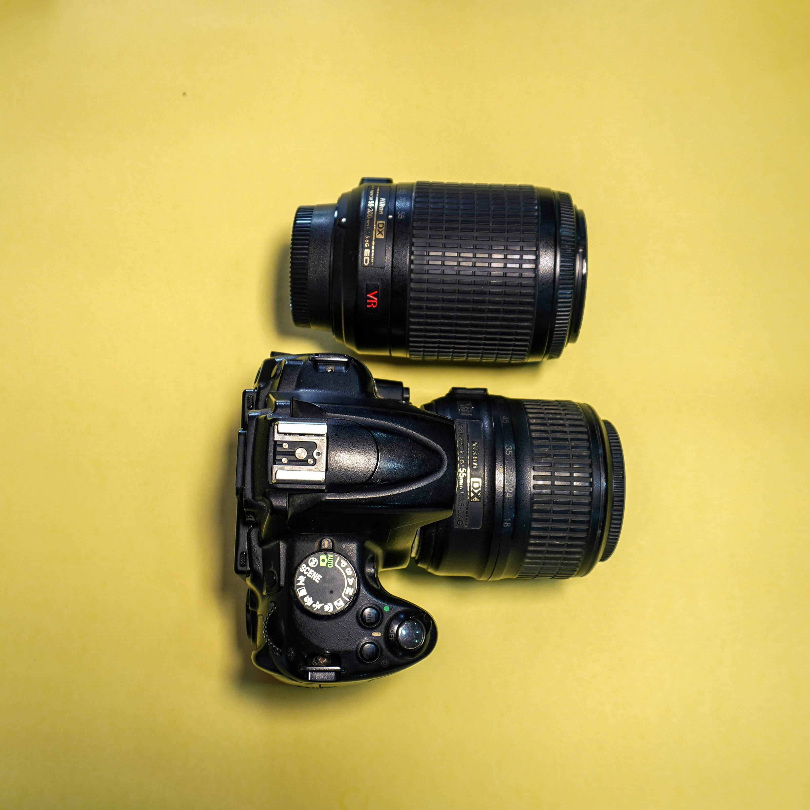

|              | Student 1    | Student 2         |
| ------------ | ------------ | ----------------- |
| Name         | Keegan Rolls | Nicholas Philpott |
| Student ID   | 202004149    | \*\*\*\*\         |

## Geometric Transformation
<!-- TODO: Finish Q6 and update code -->
The code contained within this section can be found in it's entirety in [Appendix A](#appendix-a)

1. Download the test image (im1.png) from Brightspace under Lab 01. Read the image, convert the image to a grayscale image, and display the image.

    ```m
    imc = imread("./im1.png");

    img = rgb2gray(imc);

    imshow(img);
    title('Image in grayscale');
    ```

    

2.
    a. Define the transormation matrix with a rotation angle of 45 degrees

        ```m
        % Rotate 45 degrees
        theta = 0.25*pi;

        % Transformation matrix for rotation
        R = [cos(theta) sin(theta) 0;
            -sin(theta) cos(theta) 0;
            0           0          1];
        ```

    b. Calculate the size of the transformed image and generate an empty image with the calculated size

        ```m
        [y_max, x_max] = size(img); % Obtaining the size of the image
        corners = [0,       0,      1; ...
                   x_max,   0,      1; ...
                   0,       y_max,  1; ...
                   x_max,   y_max,  1]; % Corner points of the image

        new_corners = corners*R % New location of corners
        new_width = round(max(new_corners(:,1)) - ...
        min(new_corners(:,1)));
        new_height = round(max(new_corners(:,2)) - ...
        min(new_corners(:,2)));
        new_img = zeros(new_height,new_width);
        ```

    c. Transform each pixel of the original image with the transformation matrix and assign the intensity to the new location.

        ```m
        % Insert code here
        ```

    d. View the transformed image.

        See figure 2 below

        ```m
        % Insert code here
        ```

        {width=50%}

3. Complete the steps above (Q2.a - 2.d) for angle $\theta=90^\circ$.

    See Figure 3 below.

    {width=50%}

4. Complete the steps above (Q2.a - 2.d) for angle $\theta=-25^\circ$.

    See Figure 4 below.

    {width=50%}

5. It can be seen that in some cases, when the image is transformed the output image has ‘empty’ black pixels. Explain why this happens in only some images, but not others.

    <!-- TODO: Insert talk here -->
    ...

6. In the previous questions, we defined the size of the output image and mapped each input pixel to the corresponding output pixel. We can improve the output image, ensuring no ‘black’ or ‘empty’ pixels by first calculating the size of the transformed image, generating an empty image of the correct output size, and then calculate the inverse of the forward transformation matrix. For each pixel of the transformed output image, we use the inverse transformation to search backwards in the input image for the correct pixel. In this way, every pixel in the output image will find an input pixel. If the corresponding pixel in the input image is outside image boundary, we can simply set the value of the output pixel to zero

    a. Calculate the inverse transformation matrix.

        Using the below...

        $$
        R = \begin{bmatrix}
        \cos\theta & \sin\theta & 0 \\
        -\sin\theta & \cos\theta & 0 \\
        0 & 0 & 1
        \end{bmatrix}
        $$
        $$
        R^{-1} = \begin{bmatrix}
        \cos\theta & -\sin\theta & 0 \\
        \sin\theta & \cos\theta & 0 \\
        0 & 0 & 1
        \end{bmatrix}
        $$

        Note: For a rotation matrix, the inverse is equal to its transpose. This is because rotation matrices are orthogonal matrices, where $R^{-1} = R^T$.

    b. Modify the code in Q2 to calculate the following inverse transformation, and use it to iterate through each output image pixel to search the input image for the following transformations. Visualize your results.

        i. Translation $\left( t_x = 50, t_y = 45 \right)$
        ii. Scale $\left(c_x = 0.5, c_y = 1.5\right)$
        iii. Shear (vertical) $\left(s_v = 0.2\right)$
        iv. Shear (horizontal) $\left(s_v = 0.3\right)$
        v. Rotation $\left(\theta = 50^\circ\right)$ followed by translation $\left( t_x = 25, t_y = 30 \right)$

## Histogram Equalization
<!-- TODO: Insert finished code -->
The code contained within this section can be found in it's entirety in [Appendix B](#appendix-b)

1. Download the test image (im2.png) from Brightspace under Lab 01. Read the image, convert the image to a grayscale image, and visualize it.

    ```m
    imc = imread('im2.png');% Read the image
    img = rgb2gray(imc); % Convert to grayscale
    imshow(img); % View image
    ```

2. Grayscale images have 256 gray levels. Therefore create an empty matrix having dimensions of $1\times256$, generate the histogram and display it.

    ```m
    H=size(img,1); % Read the height of the image
    W=size(img,2); % Read the width of the image
    Hist_arr=zeros(1,256); % Array for holding the (original) histogram
    Hist_eq_arr=zeros(1,256); % Array for holding the (equalized) histogram
    ```

3. Calculate $p_r\left(r_k\right)$ for the image and display it. (Total number of pixels $= y_{max}\times x_{max}$).

    ```m
    % Insert code here
    ```

4. Calculate the CDF from the PDF, and display it.

    ```m
    % Insert code here
    ```

5. Calculate the equalized histogram using equation 1 and map the original gray levels to the new gray levels. Display the original and new values.

    ```m
    % Insert code here
    ```

6. Display both images, before (original) and after histogram equilization

    See Figure 5 below

    

## Performance Evaluation
<!-- TODO: Finish the question -->
The code contained within this section can be found in it's entirety in [Appendix C](#appendix-c)

1. Download or use any image that is larger than 640×640 pixels and use your code to rotate the image by 90 degrees. Use the inbuilt functions (e.g., maketform and imtransform in MATLAB Image Processing Toolbox) to perform the rotation of the same image. Comment on the difference in speed between the two approaches.

    See Figure 6 below "im3.png".

    {width=50%}

    | Method  | Time  |
    | ------- | ----- |
    | Inbuilt | 0.2ms |
    | Custom  | 2.5s  |

2. Comment on the shape of the histogram resulting from the histogram equalization process. Is it a perfectly uniform histogram, like we would theoretically expect? Provide an explanation of why it is, or is not, uniform.

    See Figure 7 below.

    <!-- TODO: Comment on the histograms -->

\pagebreak

## Appendix A

The below code is the complete code used in [Question 1](#geometric-transformation). It is also included in this submission as `question1.m`.

<!-- TODO: Insert final code before submission -->
```m
% Insert code here
```

\pagebreak

## Appendix B

The below code is the complete code used in [Question 2](#histogram-equalization). It is also included in this submission as `question2.m`.

<!-- TODO: Insert final code before submission -->
```m
% Insert code here
```

\pagebreak

## Appendix C

The below code is the complete code used in [Question 3](#performance-evaluation). It is also included in this submission as `question3.m`.

<!-- TODO: Insert final code before submission -->
```m
% Insert code here
```
