***NOTE:*** All code contained within this report can be seen in it's entirety in [the Appendix](#appendix) or in the submitted file `L3.m`.

1. *Download the test image (puppy.jpg) and `lp_hp_filters.m` from Brightspace under Lab 03. Look at the image, and read the code and understand the implementation.*

    {#fig1 width=30%}

2. *Read the image, convert the image to grayscale, and display.*

    See [Figure 2](#fig2) below.

    ```m
    %% Step 1 & 2: Read and display the image
    F_rgb = imread('puppy.jpg'); % read the rgb image
    F = rgb2gray(F_rgb); % convert to grayscale
    ```

    {#fig2 width=30%}

3. *Obtain the padding parameters. Display them.*

    The below code gives us and image size of $300\times 332$. Thus, $P=600, Q=664$.

    ```m
    %% Step 3: Obtain and display padding parameters
    im_size = size(F);
    P = 2 * im_size(1);
    Q = 2 * im_size(2);
    fprintf('Image size: %d x %d\n', im_size(1), im_size(2));
    fprintf('Padding parameters: P = %d, Q = %d\n', P, Q);
    ```

    This is confirmed in the console when the file is run.

    ```txt
    Image size: 300 x 332
    Padding parameters: P = 600, Q = 664
    ```

4. *Obtain and display the FT of the image.*

    See [Figure 3](#fig3) below.

    ```m
    %% Step 4: Obtain and display FT of the image
    FTIm = fft2(double(F), P, Q);

    % Save Fourier Transform visualization
    ft_display = log(1 + abs(fftshift(FTIm)));
    ft_display = uint8(255 * mat2gray(ft_display));
    ```

    {#fig3 width=80%}

5. *Design the filter.*

    See implementation for each filter in each section below.

6. *Implement the following filters (a. to f.): multiply the FT of the image with filter, undo the padding, move the origin of frequency spectrum to the centre and display the results.*

    a. ***Ideal** low pass filters for cut-off frequencies (0.3 and 0.7 of image height).*

        The below code was used to generate [Figure 4](#fig4) and [Figure 5](#fig5).

        ```m
        % Step 6a: Ideal low pass filters
        cutoffs_a = [0.3, 0.7];
        for i = 1:length(cutoffs_a)
            D0 = cutoffs_a(i) * im_size(1);
            Filter = lp_hp_filters('ideal', 'lp', P, Q, D0, 0);

            Filtered_image = real(ifft2(Filter .* FTIm));
            Filtered_image = Filtered_image(1:im_size(1), 1:im_size(2));
            Fim = fftshift(FTIm);
            FTI = log(1 + abs(Fim));
            Ff = fftshift(Filter);
            FTF = log(1 + abs(Ff));
        end
        ```

        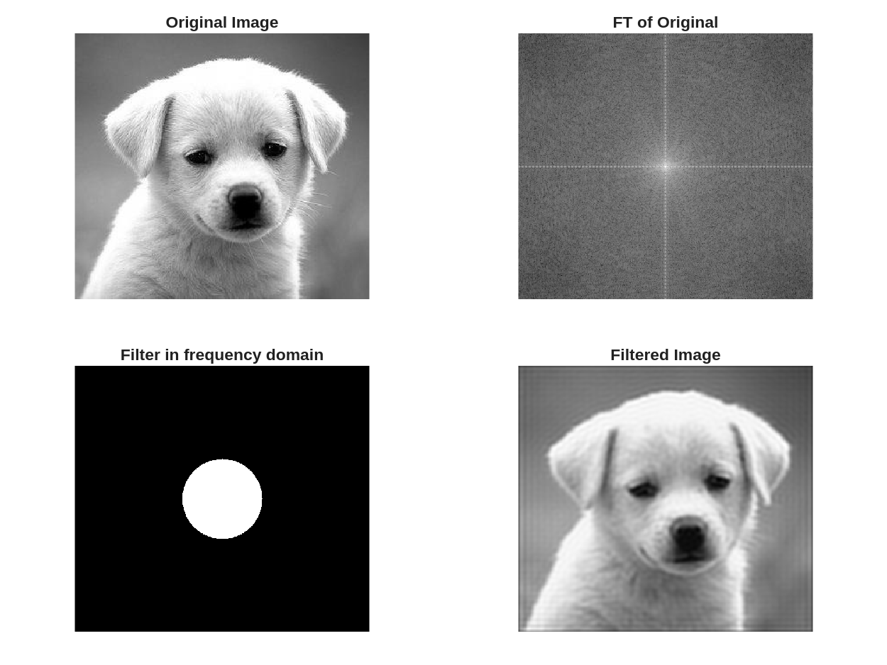{#fig4}

        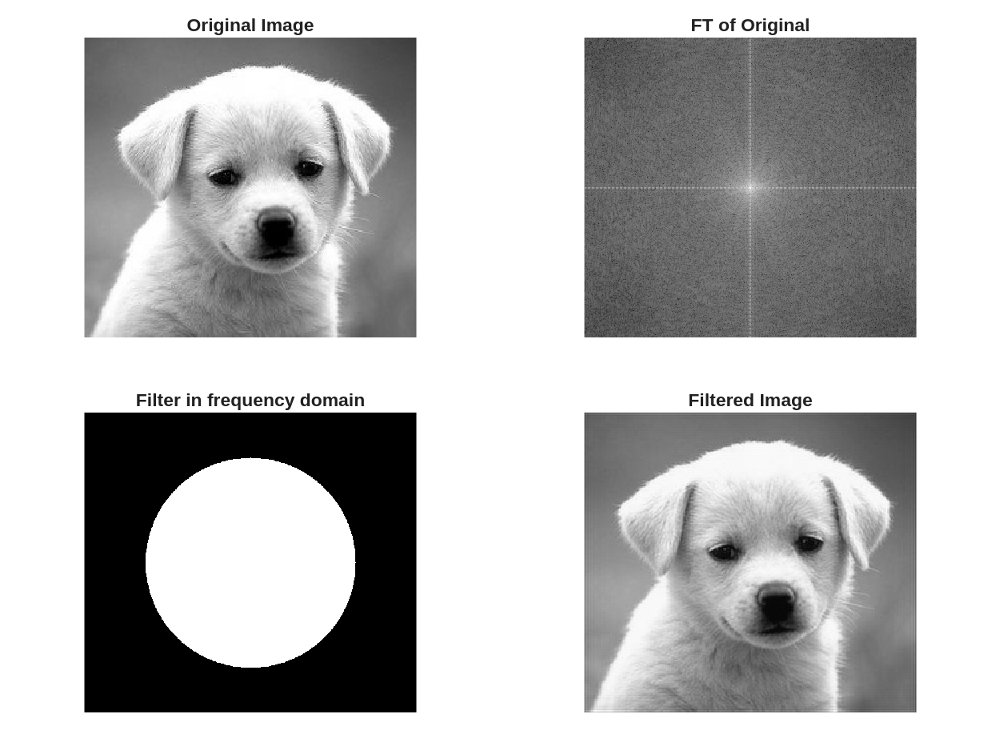{#fig5}

        \pagebreak

    b. ***Butterworth** low pass filters for cut-off frequencies (0.1 and 0.5 of image height) and order n = 1, 5, 20.*

        The below code was used to generate [Figure 6](#fig6) through [Figure 11](#fig11).

        ```m
        %% Step 6b: Butterworth low pass filters
        cutoffs_b = [0.1, 0.5];
        orders = [1, 5, 20];
        for i = 1:length(cutoffs_b)
            for j = 1:length(orders)
                D0 = cutoffs_b(i) * im_size(1);
                Filter = lp_hp_filters('btw', 'lp', P, Q, D0, orders(j));

                Filtered_image = real(ifft2(Filter .* FTIm));
                Filtered_image = Filtered_image(1:im_size(1), 1:im_size(2));
                Fim = fftshift(FTIm);
                FTI = log(1 + abs(Fim));
                Ff = fftshift(Filter);
                FTF = log(1 + abs(Ff));
            end
        end
        ```

        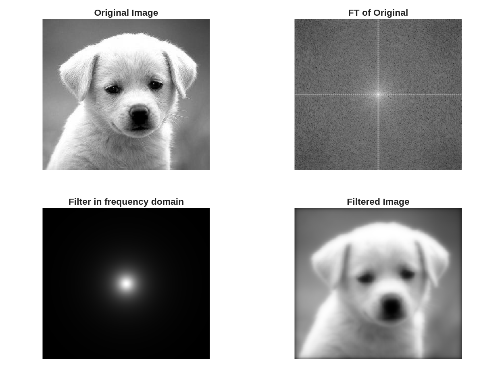{#fig6 width=90%}

        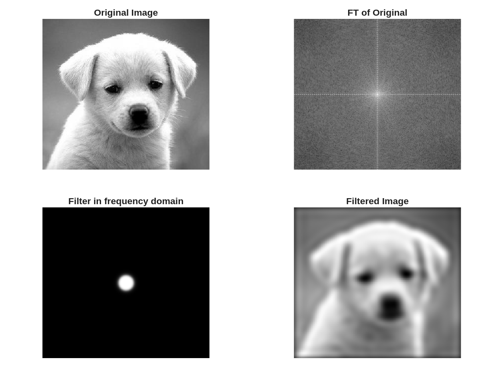{#fig7}

        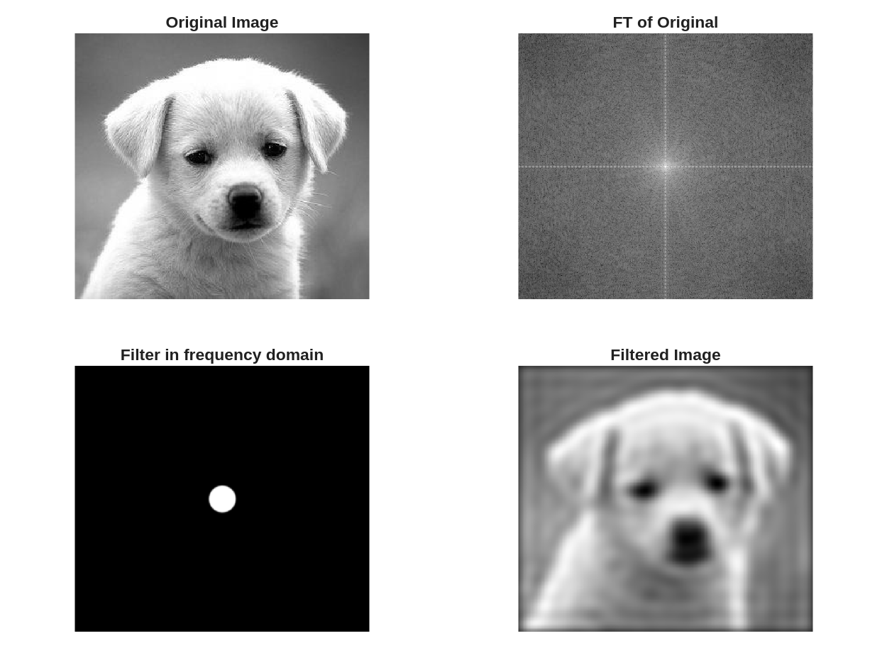{#fig8}

        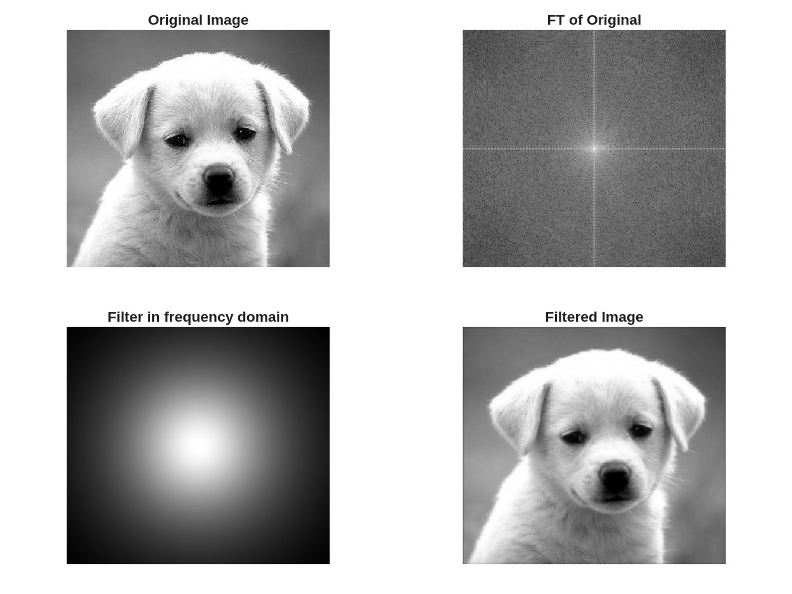{#fig9}

        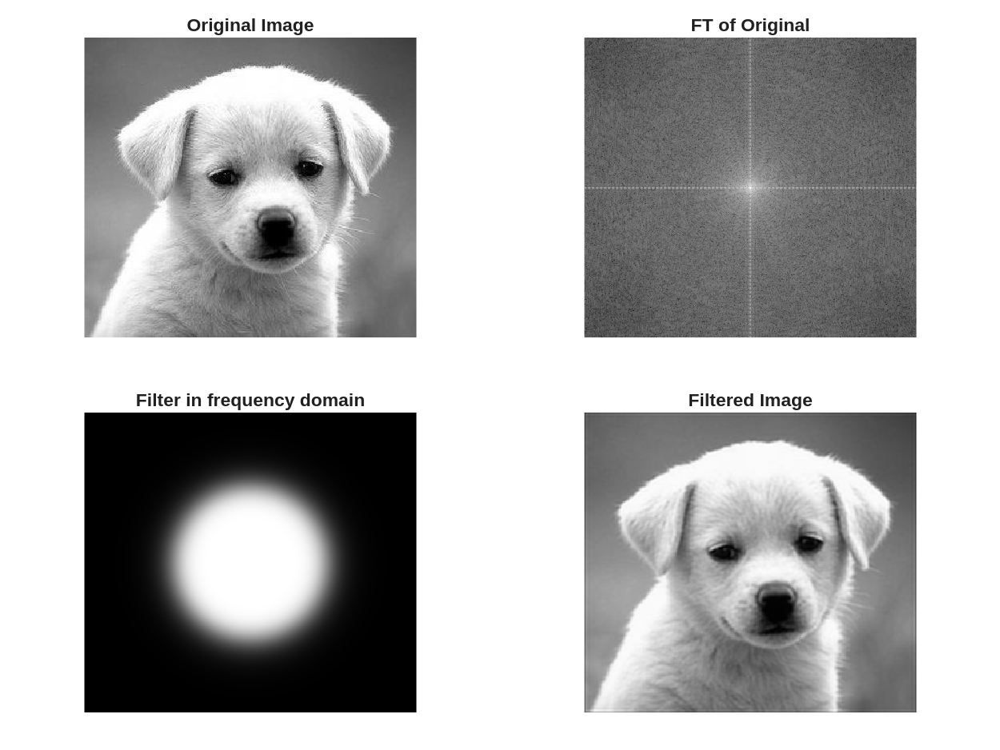{#fig10}

        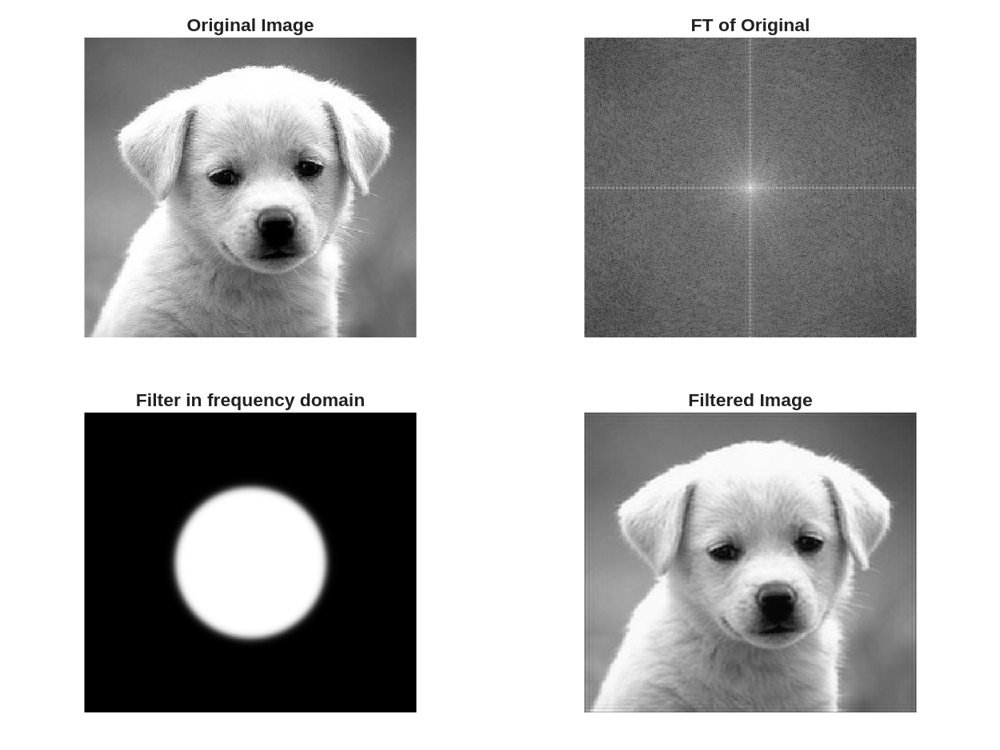{#fig11}

        \pagebreak

    c. ***Gaussian** low pass filters for cut-off frequencies (0.1, 0.3 and 0.7 of image height).*

        The below code was used to generate [Figure 12](#fig12) through [Figure 14](#fig14).

        ```m
        %% Step 6c: Gaussian low pass filters
        cutoffs_c = [0.1, 0.3, 0.7];
        for i = 1:length(cutoffs_c)
            D0 = cutoffs_c(i) * im_size(1);
            Filter = lp_hp_filters('gaussian', 'lp', P, Q, D0, 0);

            Filtered_image = real(ifft2(Filter .* FTIm));
            Filtered_image = Filtered_image(1:im_size(1), 1:im_size(2));
            Fim = fftshift(FTIm);
            FTI = log(1 + abs(Fim));
            Ff = fftshift(Filter);
            FTF = log(1 + abs(Ff));
        end
        ```

        {#fig12}

        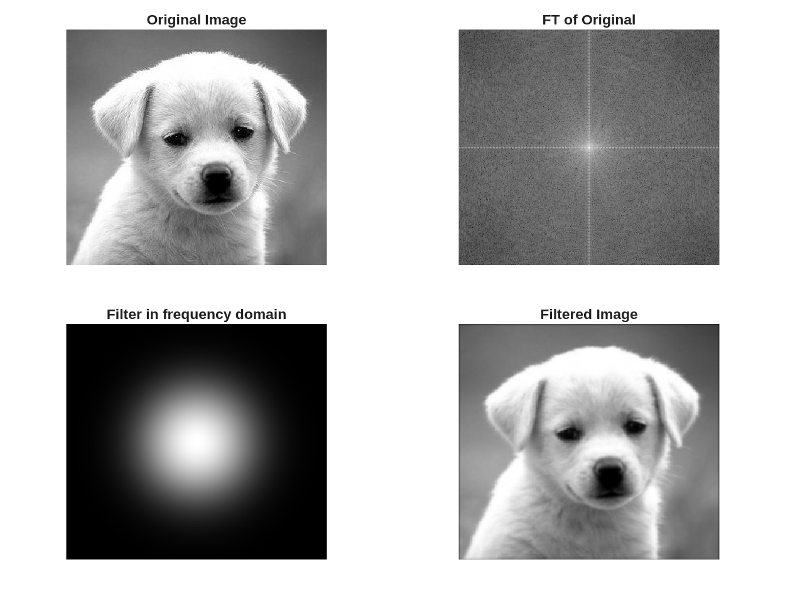{#fig13}

        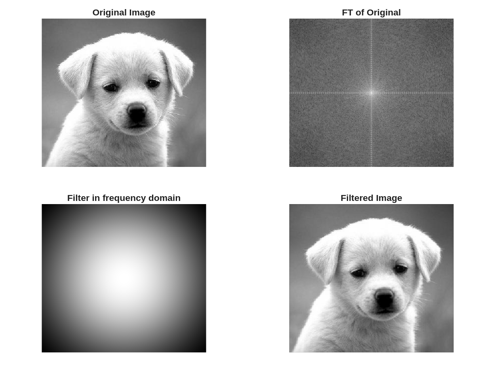{#fig14}

        \pagebreak

    d. ***Ideal** high-pass filters for cut-off frequencies (0.1, 0.3 and 0.7 of image height).*

        The below code was used to generate [Figure 15](#fig15) through [Figure 17](#fig17).

        ```m
        %% Step 6d: Ideal high pass filters
        cutoffs_d = [0.1, 0.3, 0.7];
        for i = 1:length(cutoffs_d)
            D0 = cutoffs_d(i) * im_size(1);
            Filter = lp_hp_filters('ideal', 'hp', P, Q, D0, 0);

            Filtered_image = real(ifft2(Filter .* FTIm));
            Filtered_image = Filtered_image(1:im_size(1), 1:im_size(2));
            Fim = fftshift(FTIm);
            FTI = log(1 + abs(Fim));
            Ff = fftshift(Filter);
            FTF = log(1 + abs(Ff));
        end
        ```

        {#fig15}

        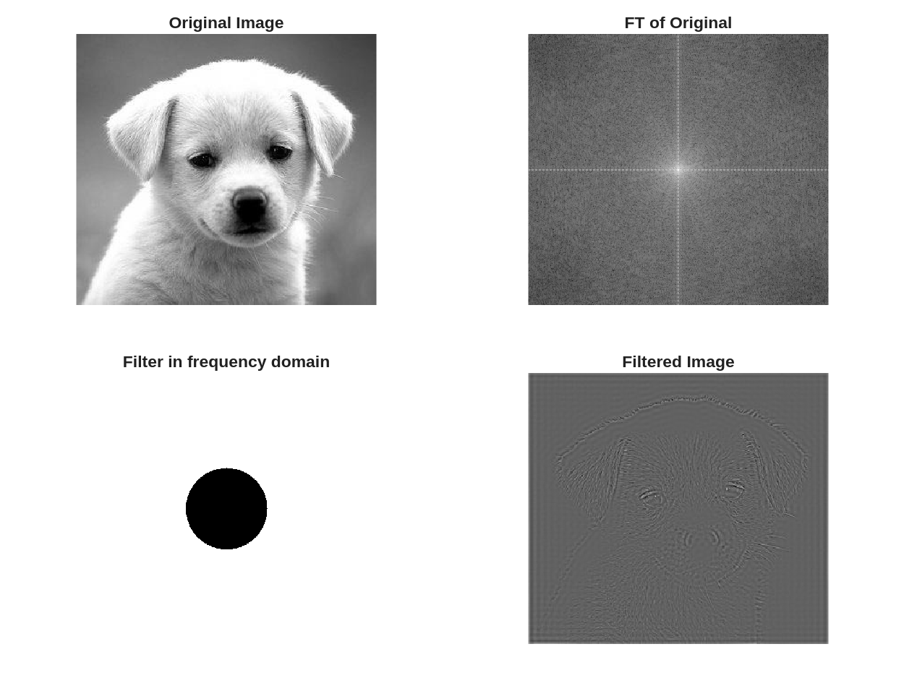{#fig16}

        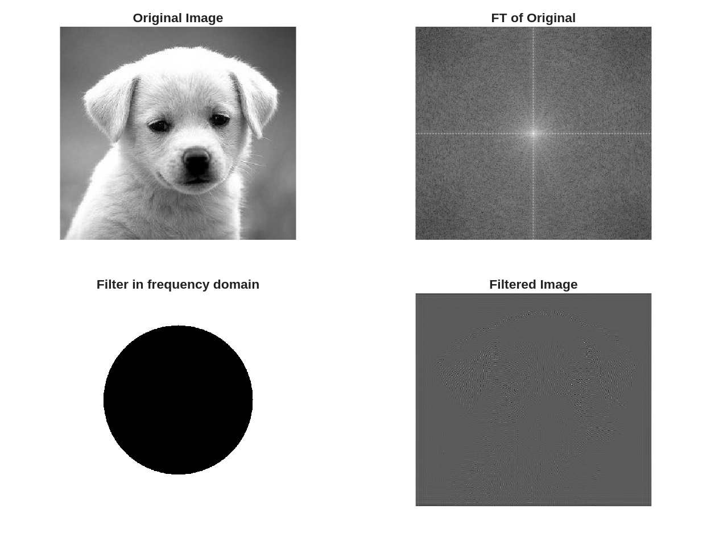{#fig17}

        \pagebreak

    e. ***Butterworth** high pass filters for cut-off frequencies (0.1 and 0.5 of image height) and order n = 1, 5, 20.*

        The below code was used to generate [Figure 18](#fig18) through [Figure 23](#fig23).

        ```m
        %% Step 6e: Butterworth high pass filters
        cutoffs_e = [0.1, 0.5];
        orders = [1, 5, 20];
        for i = 1:length(cutoffs_e)
            for j = 1:length(orders)
                D0 = cutoffs_e(i) * im_size(1);
                Filter = lp_hp_filters('btw', 'hp', P, Q, D0, orders(j));

                Filtered_image = real(ifft2(Filter .* FTIm));
                Filtered_image = Filtered_image(1:im_size(1), 1:im_size(2));
                Fim = fftshift(FTIm);
                FTI = log(1 + abs(Fim));
                Ff = fftshift(Filter);
                FTF = log(1 + abs(Ff));
            end
        end
        ```

        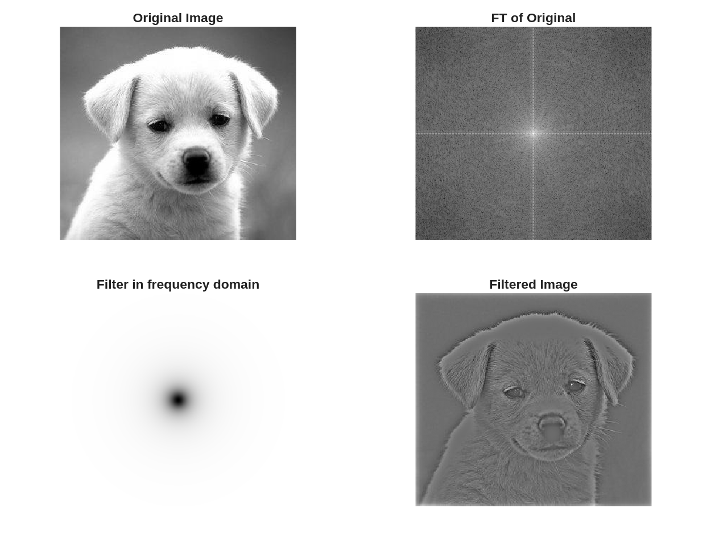{#fig18 width=90%}

        {#fig19}

        {#fig20}

        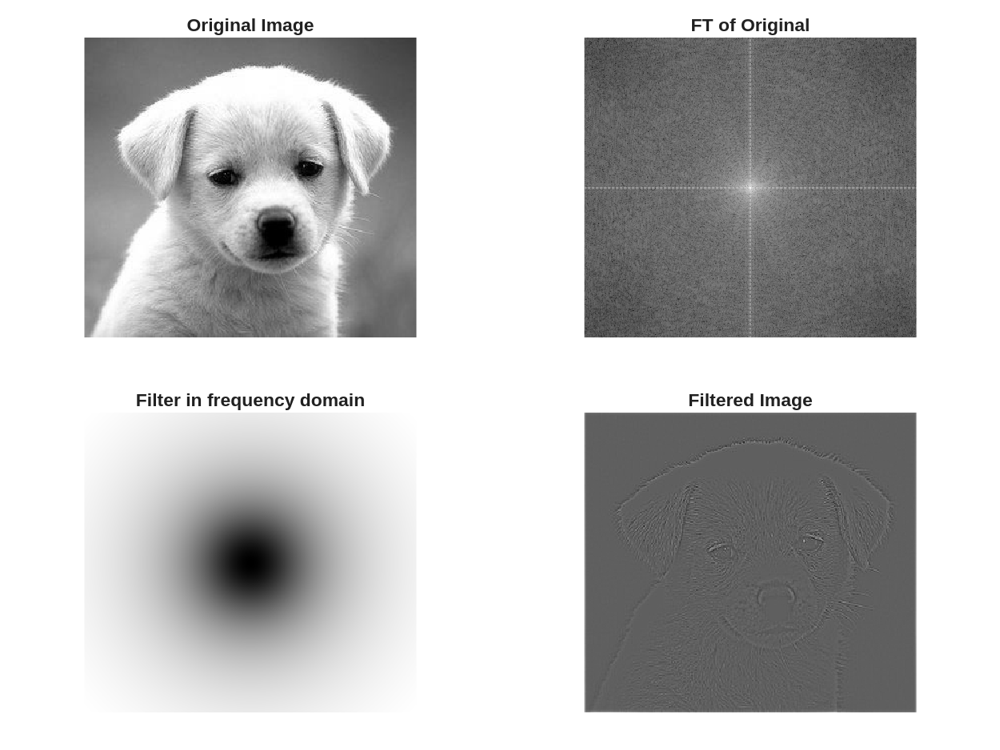{#fig21}

        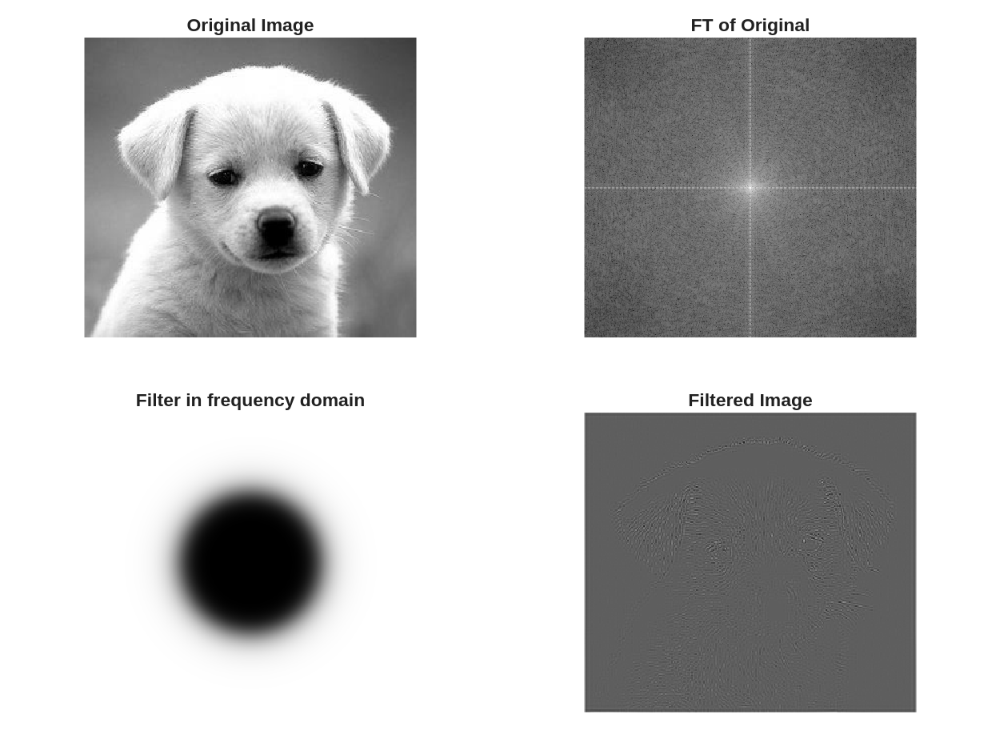{#fig22}

        {#fig23}

        \pagebreak

    f. ***Gaussian** high pass filters for cut-off frequencies (0.1, 0.3 and 0.7 of image height).*

        The below code was used to generate [Figure 24](#fig24) through [Figure 26](#fig26).

        ```m
        %% Step 6f: Gaussian high pass filters
        cutoffs_f = [0.1, 0.3, 0.7];
        for i = 1:length(cutoffs_f)
            D0 = cutoffs_f(i) * im_size(1);
            Filter = lp_hp_filters('gaussian', 'hp', P, Q, D0, 0);

            Filtered_image = real(ifft2(Filter .* FTIm));
            Filtered_image = Filtered_image(1:im_size(1), 1:im_size(2));
            Fim = fftshift(FTIm);
            FTI = log(1 + abs(Fim));
            Ff = fftshift(Filter);
            FTF = log(1 + abs(Ff));
        end
        ```

        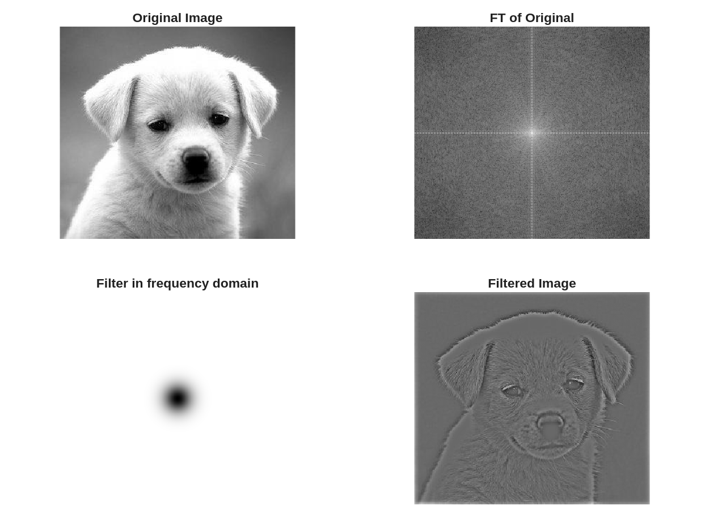{#fig24}

        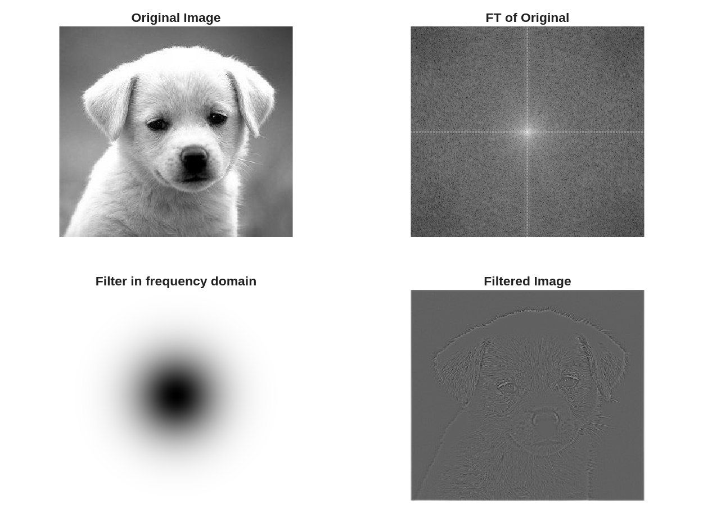{#fig25}

        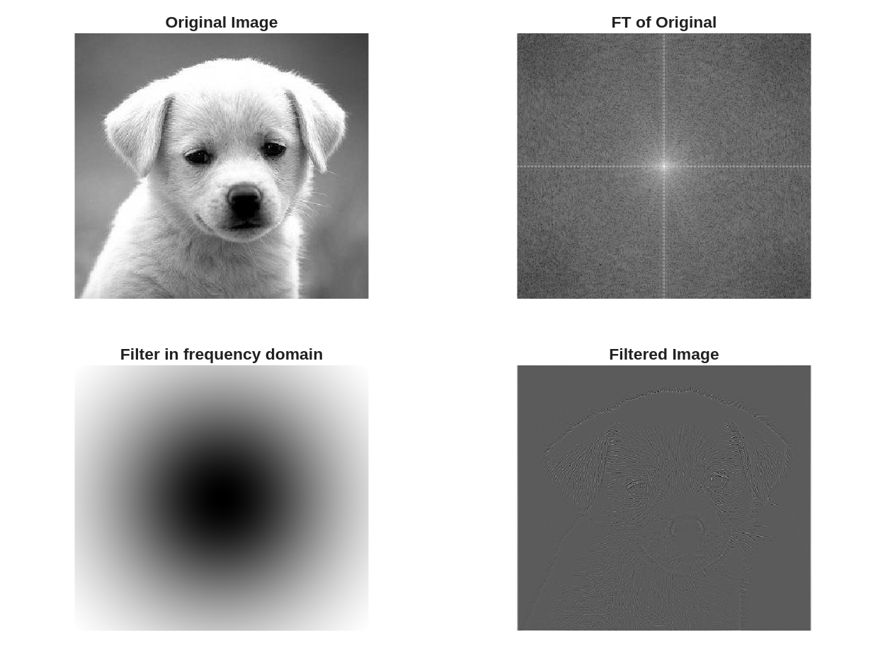{#fig26}

        \pagebreak

7. *What can you observe when increasing the cut off frequency radius of the **Ideal** filter?*

    <!-- TODO: Complete this -->

8. *What can you observe when increasing the order of the **Butterworth** filter when the cut-off frequency remains the same?*

    <!-- TODO: Complete this -->

9. *Discuss the general performance of the **Gaussian** filters in comparison to the **Ideal** and **Butterworth** filters. You do not need to discuss each possible comparison case. Only discuss any interesting phenomenon or performance observations.*

    <!-- TODO: Complete this -->

## Appendix

```m
%% Laboratory 3: Frequency Domain Filtering

%% Create output directory
if ~exist('./L3/out', 'dir')
    mkdir('./L3/out');
end

%% Set default figure properties
set(0, 'DefaultFigureUnits', 'pixels');
set(0, 'DefaultFigurePosition', [100, 100, 800, 600]);
set(0, 'DefaultAxesLooseInset', [0.02, 0.02, 0.02, 0.02]);
set(0, 'DefaultAxesPosition', [0.05, 0.05, 0.9, 0.9]);

%% Define subplot positions
pos = [0.05, 0.55, 0.4, 0.4;
       0.55, 0.55, 0.4, 0.4;
       0.05, 0.05, 0.4, 0.4;
       0.55, 0.05, 0.4, 0.4];

%% Step 1 & 2: Read and display the image
F_rgb = imread('puppy.jpg');
F = rgb2gray(F_rgb);

imwrite(F, './L3/out/01_original_grayscale.png');

%% Step 3: Obtain and display padding parameters
im_size = size(F);
P = 2 * im_size(1);
Q = 2 * im_size(2);
fprintf('Image size: %d x %d\n', im_size(1), im_size(2));
fprintf('Padding parameters: P = %d, Q = %d\n', P, Q);

%% Step 4: Obtain and display FT of the image
FTIm = fft2(double(F), P, Q);

ft_display = log(1 + abs(fftshift(FTIm)));
ft_display = uint8(255 * mat2gray(ft_display));
imwrite(ft_display, './L3/out/04_fourier_transform.png');

%% Step 6a: Ideal low pass filters
cutoffs_a = [0.3, 0.7];
for i = 1:length(cutoffs_a)
    D0 = cutoffs_a(i) * im_size(1);
    Filter = lp_hp_filters('ideal', 'lp', P, Q, D0, 0);

    Filtered_image = real(ifft2(Filter .* FTIm));
    Filtered_image = Filtered_image(1:im_size(1), 1:im_size(2));
    Fim = fftshift(FTIm);
    FTI = log(1 + abs(Fim));
    Ff = fftshift(Filter);
    FTF = log(1 + abs(Ff));

    fig = figure('Visible', 'off');
    subplot('Position', pos(1, :)); imshow(F, []); title('Original Image');
    subplot('Position', pos(2, :)); imshow(FTI, []); title('FT of Original');
    subplot('Position', pos(3, :)); imshow(FTF, []); title('Filter in frequency domain');
    subplot('Position', pos(4, :)); imshow(Filtered_image, []); title('Filtered Image');

    fig_filename = sprintf('./L3/out/6a_ideal_lp_D0_%.1f.png', cutoffs_a(i));
    saveas(fig, fig_filename);
    close(fig);
end

%% Step 6b: Butterworth low pass filters
cutoffs_b = [0.1, 0.5];
orders = [1, 5, 20];
for i = 1:length(cutoffs_b)
    for j = 1:length(orders)
        D0 = cutoffs_b(i) * im_size(1);
        Filter = lp_hp_filters('btw', 'lp', P, Q, D0, orders(j));

        Filtered_image = real(ifft2(Filter .* FTIm));
        Filtered_image = Filtered_image(1:im_size(1), 1:im_size(2));
        Fim = fftshift(FTIm);
        FTI = log(1 + abs(Fim));
        Ff = fftshift(Filter);
        FTF = log(1 + abs(Ff));

        fig = figure('Visible', 'off');
        subplot('Position', pos(1, :)); imshow(F, []); title('Original Image');
        subplot('Position', pos(2, :)); imshow(FTI, []); title('FT of Original');
        subplot('Position', pos(3, :)); imshow(FTF, []); title('Filter in frequency domain');
        subplot('Position', pos(4, :)); imshow(Filtered_image, []); title('Filtered Image');

        fig_filename = sprintf('./L3/out/6b_butterworth_lp_D0_%.1f_n_%d.png', cutoffs_b(i), orders(j));
        saveas(fig, fig_filename);
        close(fig);
    end
end

%% Step 6c: Gaussian low pass filters
cutoffs_c = [0.1, 0.3, 0.7];
for i = 1:length(cutoffs_c)
    D0 = cutoffs_c(i) * im_size(1);
    Filter = lp_hp_filters('gaussian', 'lp', P, Q, D0, 0);

    Filtered_image = real(ifft2(Filter .* FTIm));
    Filtered_image = Filtered_image(1:im_size(1), 1:im_size(2));
    Fim = fftshift(FTIm);
    FTI = log(1 + abs(Fim));
    Ff = fftshift(Filter);
    FTF = log(1 + abs(Ff));

    fig = figure('Visible', 'off');
    subplot('Position', pos(1, :)); imshow(F, []); title('Original Image');
    subplot('Position', pos(2, :)); imshow(FTI, []); title('FT of Original');
    subplot('Position', pos(3, :)); imshow(FTF, []); title('Filter in frequency domain');
    subplot('Position', pos(4, :)); imshow(Filtered_image, []); title('Filtered Image');

    fig_filename = sprintf('./L3/out/6c_gaussian_lp_D0_%.1f.png', cutoffs_c(i));
    saveas(fig, fig_filename);
    close(fig);
end

%% Step 6d: Ideal high pass filters
cutoffs_d = [0.1, 0.3, 0.7];
for i = 1:length(cutoffs_d)
    D0 = cutoffs_d(i) * im_size(1);
    Filter = lp_hp_filters('ideal', 'hp', P, Q, D0, 0);

    Filtered_image = real(ifft2(Filter .* FTIm));
    Filtered_image = Filtered_image(1:im_size(1), 1:im_size(2));
    Fim = fftshift(FTIm);
    FTI = log(1 + abs(Fim));
    Ff = fftshift(Filter);
    FTF = log(1 + abs(Ff));

    fig = figure('Visible', 'off');
    subplot('Position', pos(1, :)); imshow(F, []); title('Original Image');
    subplot('Position', pos(2, :)); imshow(FTI, []); title('FT of Original');
    subplot('Position', pos(3, :)); imshow(FTF, []); title('Filter in frequency domain');
    subplot('Position', pos(4, :)); imshow(Filtered_image, []); title('Filtered Image');

    fig_filename = sprintf('./L3/out/6d_ideal_hp_D0_%.1f.png', cutoffs_d(i));
    saveas(fig, fig_filename);
    close(fig);
end

%% Step 6e: Butterworth high pass filters
cutoffs_e = [0.1, 0.5];
orders = [1, 5, 20];
for i = 1:length(cutoffs_e)
    for j = 1:length(orders)
        D0 = cutoffs_e(i) * im_size(1);
        Filter = lp_hp_filters('btw', 'hp', P, Q, D0, orders(j));

        Filtered_image = real(ifft2(Filter .* FTIm));
        Filtered_image = Filtered_image(1:im_size(1), 1:im_size(2));
        Fim = fftshift(FTIm);
        FTI = log(1 + abs(Fim));
        Ff = fftshift(Filter);
        FTF = log(1 + abs(Ff));

        fig = figure('Visible', 'off');
        subplot('Position', pos(1, :)); imshow(F, []); title('Original Image');
        subplot('Position', pos(2, :)); imshow(FTI, []); title('FT of Original');
        subplot('Position', pos(3, :)); imshow(FTF, []); title('Filter in frequency domain');
        subplot('Position', pos(4, :)); imshow(Filtered_image, []); title('Filtered Image');

        fig_filename = sprintf('./L3/out/6e_butterworth_hp_D0_%.1f_n_%d.png', cutoffs_e(i), orders(j));
        saveas(fig, fig_filename);
        close(fig);
    end
end

%% Step 6f: Gaussian high pass filters
cutoffs_f = [0.1, 0.3, 0.7];
for i = 1:length(cutoffs_f)
    D0 = cutoffs_f(i) * im_size(1);
    Filter = lp_hp_filters('gaussian', 'hp', P, Q, D0, 0);

    Filtered_image = real(ifft2(Filter .* FTIm));
    Filtered_image = Filtered_image(1:im_size(1), 1:im_size(2));
    Fim = fftshift(FTIm);
    FTI = log(1 + abs(Fim));
    Ff = fftshift(Filter);
    FTF = log(1 + abs(Ff));

    fig = figure('Visible', 'off');
    subplot('Position', pos(1, :)); imshow(F, []); title('Original Image');
    subplot('Position', pos(2, :)); imshow(FTI, []); title('FT of Original');
    subplot('Position', pos(3, :)); imshow(FTF, []); title('Filter in frequency domain');
    subplot('Position', pos(4, :)); imshow(Filtered_image, []); title('Filtered Image');

    fig_filename = sprintf('./L3/out/6f_gaussian_hp_D0_%.1f.png', cutoffs_f(i));
    saveas(fig, fig_filename);
    close(fig);
end
```
