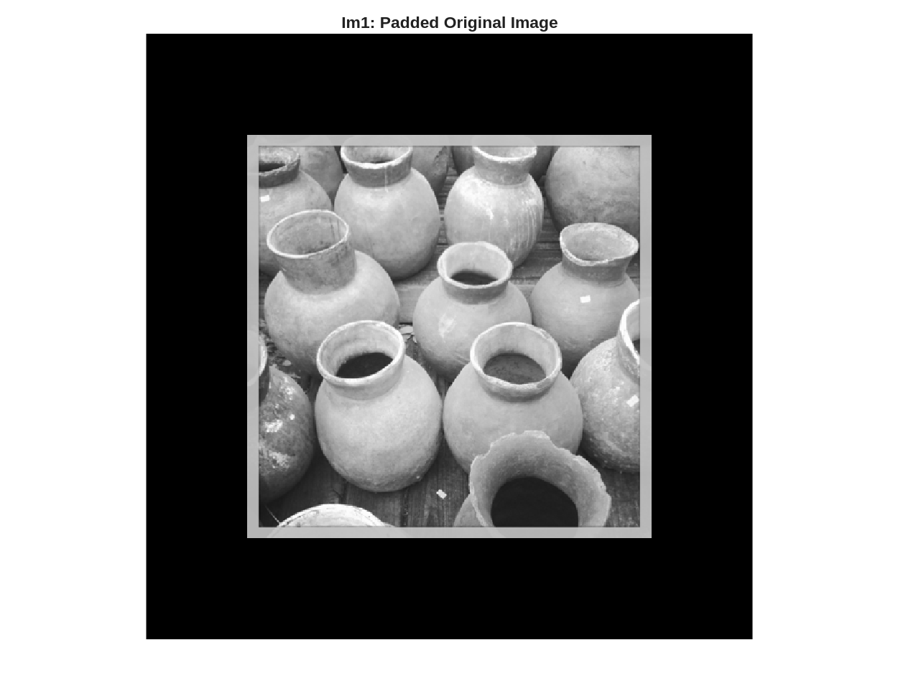
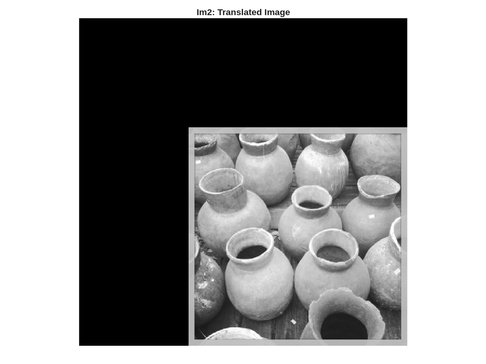
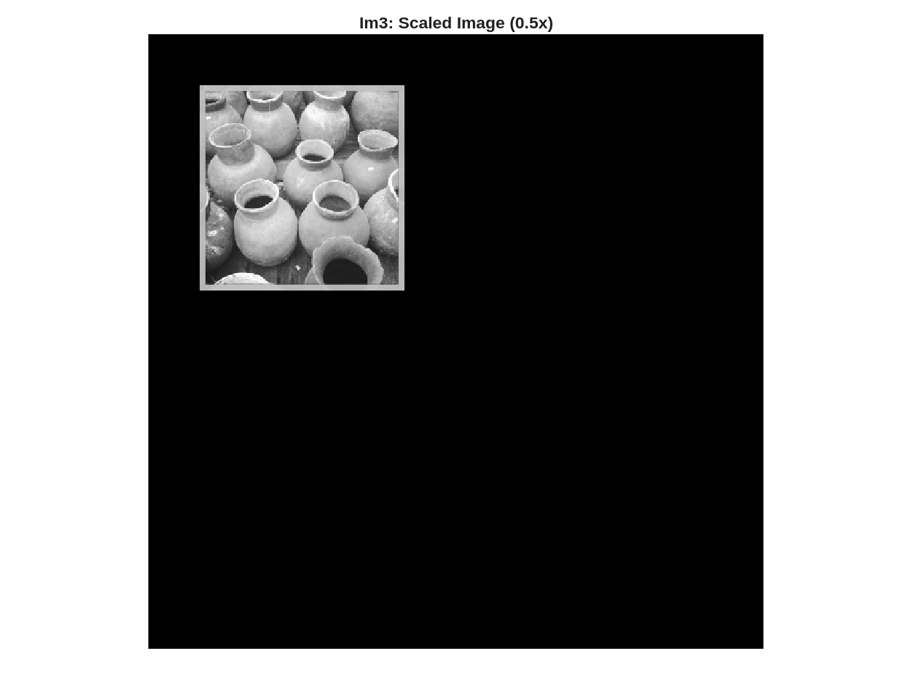
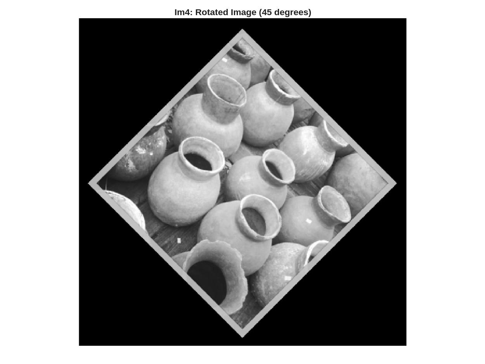
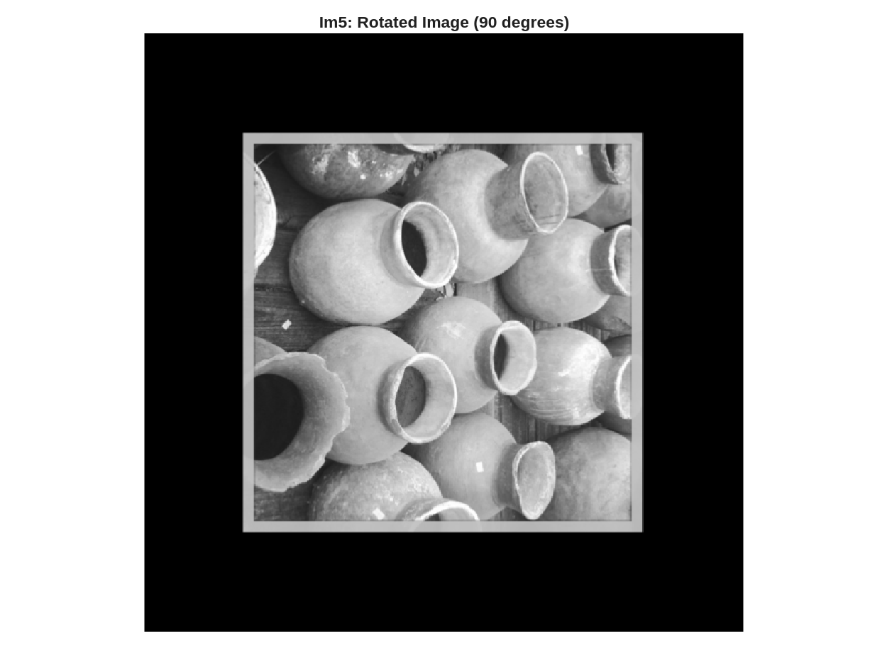
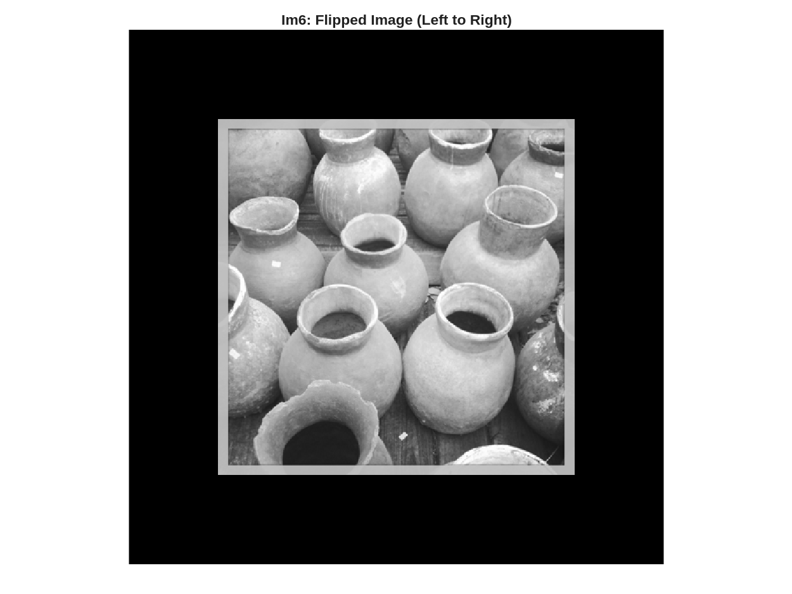

***NOTE:*** All code contained within this report can be seen in it's entirety in [the Appendix](#appendix) or in the submitted file `L4.m`.

1. *Download the grayscale test image (image.png), `calculate_moments.m`, and `Moment_invariants.m` files from Brightspace under Lab 04 and save them in your working directory. Read the files and understand the implementation of calculating the seven invariant moments.*

    The required files were downloaded and placed in the working directory. The implementation calculates Hu's seven moment invariants which are features that remain unchanged under translation, scaling, and rotation transformations.

2. *Read the image, obtain the size of the image and pad the image by one-fourth the image size in all directions with zeros, and display the padded image. Use this as the basis for next steps (referred to as Im1).*

    See [Figure 1](#fig1) below.

    ```m
    !include`startLine=14,endLine=34` "../src/L4.m"
    ```

    {#fig1 width=50%}

3. *Create and display the spatial transformation matrices T1 for translation, T2 for scaling to 0.5 (of original size), T3 to rotate the image by 45 degrees, T4 for rotating the image 90 degrees.*

    ```m
    !include`startLine=36,endLine=55` "../src/L4.m"
    ```

4. *Transform Im1 with T1 and display the translated Im2*

    See [Figure 2](#fig2) below.

    ```m
    !include`startLine=57,endLine=59` "../src/L4.m"
    ```

    {#fig2 width=50%}

    \pagebreak

5. *Transform Im1 with T2 and display the scaled Im3:*

    See [Figure 3](#fig3) below.

    ```m
    !include`startLine=67,endLine=69` "../src/L4.m"
    ```

    {#fig3 width=50%}

6. *Transform Im1 with T3 and display the rotated Im4:*

    See [Figure 4](#fig4) below.

    ```m
    !include`startLine=77,endLine=80` "../src/L4.m"
    ```

    {#fig4 width=50%}

7. *Transform Im1 with T4 and display the rotated Im5:*

    See [Figure 5](#fig5) below.

    ```m
    !include`startLine=87,endLine=90` "../src/L4.m"
    ```

    {#fig5 width=50%}

8. *Flip the original image Im1 from left to right using following command, generate and display flipped*

    See [Figure 6](#fig6) below.

    ```m
    !include`startLine=98,endLine=99` "../src/L4.m"
    ```

    {#fig6 width=50%}

    \pagebreak

9. *The file `Moment_invariant.m` contains a function `Moment_invariant()`, which calls another function named `calculate_moments`. Collectively, these functions calculate the moment invariants. Use the function `Moment_invariant()` with images Im1 to Im6 (e.g., `Moment_invariants(Im1);`) to calculate the moment invariants for each image. Report the moments for each image in a table.*

    ```m
    !include`startLine=107,endLine=134` "../src/L4.m"
    ```

    <!-- Table data automatically generated from ../out/moment_invariants_table.csv -->

    | Moment | Im1, Original | Im2, Translated | Im3, Scaled | Im4, Rotated $45^\circ$ | Im5, Rotated $90^\circ$ | Im6, Flipped |
    |--------|---------------|-----------------|-------------|-------------------------|-------------------------|----------------|
    | 1 | -2.980 | -2.980 | -2.980 | -2.980 | -2.980 | -2.980 |
    | 2 | -9.054 | -9.054 | -9.061 | -9.054 | -9.054 | -9.054 |
    | 3 | -11.681 | -11.681 | -11.677 | -11.683 | -11.681 | -11.681 |
    | 4 | -11.746 | -11.746 | -11.731 | -11.745 | -11.746 | -11.746 |
    | 5 | -23.555 | -23.555 | -23.540 | -23.555 | -23.555 | -23.555 |
    | 6 | 16.273 | 16.273 | 16.261 | 16.272 | 16.273 | 16.273 |
    | 7 | 23.683 | 23.683 | 23.641 | 23.683 | 23.683 | -23.683 |

    Table: Hu's Moment Invariants for all image transformations

10. *Discuss the values of the moment invariants computed for each image, including any similarities or differences. What do these similarities or differences mean in terms of image features?*

    ```m
    !include`startLine=136,endLine=161` "../src/L4.m"
    ```

    The above code was used to generate the below output.\pagebreak

    ```txt
    === ANALYSIS FOR QUESTION 10 ===

    Relative differences from original image (Im1):
    Transformation      Mom1(%)     Mom2(%)     Mom3(%)     Mom4(%)     Mom5(%)     Mom6(%)     Mom7(%)
    ----------------------------------------------------------------------------------------------------

    Translation           0.00%       0.00%       0.00%       0.00%       0.00%       0.00%       0.00%
    Scaling               0.01%       0.08%       0.04%       0.13%       0.06%       0.07%       0.18%
    Rotation 45°          0.00%       0.00%       0.01%       0.01%       0.00%       0.00%       0.00%
    Rotation 90°          0.00%       0.00%       0.00%       0.00%       0.00%       0.00%       0.00%
    Flipping              0.00%       0.00%       0.00%       0.00%       0.00%       0.00%     200.00%
    ```

    The computed moment invariants demonstrate invariance properties across different transformations:

    1. **Translation** (`Im2`):
        - All seven moment invariants remain virtually identical to the original image ($0.00\%$ difference).
        - This demonstrates that shape characteristics are preserved regardless of object position in the image.

    2. **Scaling** (`Im3`):
        - Moments show small variations ($0.01$--$0.18\%$) due to numerical precision and interpolation effects during the scaling transformation.
        - Despite these minor differences, the moments maintain their essential invariance properties, indicating that object size changes do not significantly affect the shape descriptors.

    3. **Rotation** (`Im4`, `Im5`):
        - Both $45^\circ$ and $90^\circ$ rotations preserve moment values almost perfectly ($\leq 0.01\%$ difference), demonstrating excellent rotational invariance.
        - This confirms that Hu's moments successfully capture shape features independent of object orientation.

    4. **Reflection/Flipping** (`Im6`):
        - Moments $1$--$6$ remain unchanged ($0.00\%$ difference), while moment $7$ exhibits a complete sign change ($200\%$ difference, from $+23.683$ to $-23.683$).
        - This behavior is theoretically expected---moment $7$ is designed to distinguish between mirror images, making it useful for detecting reflectional symmetry.

    These results confirm that Hu's moment invariants effectively capture intrinsic shape properties that are independent of geometric transformations. Moments $1$--$6$ provide robust shape descriptors for object recognition tasks regardless of position, size, or orientation, while moment $7$ serves as a chirality detector for distinguishing between an object and its mirror image.

\pagebreak

## Appendix

```m
!include "../src/L4.m"
```
