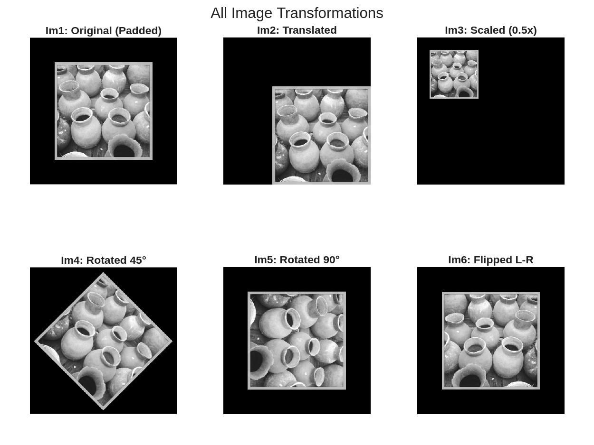
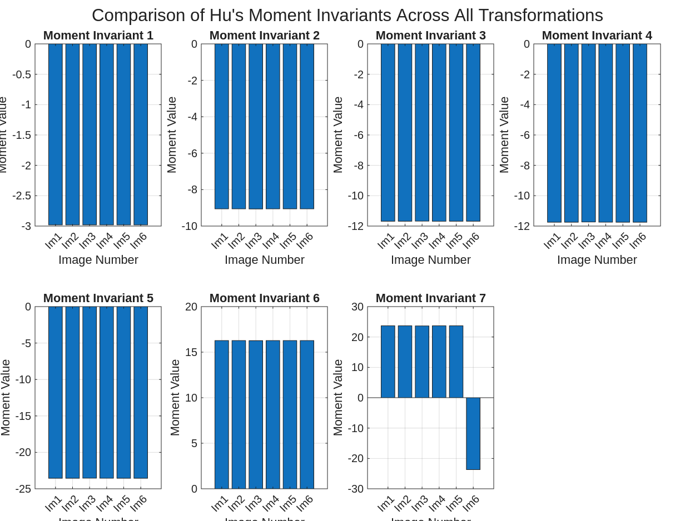

***NOTE:*** All code contained within this report can be seen in it's entirety in [the Appendix](#appendix) or in the submitted file `L4.m`.

1. *Download the grayscale test image (image.png), calculate moments.m, and Moment invariants.m files from Brightspace under Lab 04 and save them in your working directory. Read the files and understand the implementation of calculating the seven invariant moments.*

    The required files were downloaded and placed in the working directory. The implementation calculates Hu's seven moment invariants which are features that remain unchanged under translation, scaling, and rotation transformations.

2. *Read the image, obtain the size of the image and pad the image by one-fourth the image size in all directions with zeros, and display the padded image. Use this as the basis for next steps (referred to as Im1).*

    See [Figure 1](#fig1) below.

    ```m
    %% Step 2: Read image, get size, pad by 1/4, and display
    img = imread('image.png');
    if size(img, 3) == 3
        img = rgb2gray(img);
    end
    img = double(img);

    [rows, cols] = size(img);
    fprintf('Original image size: %d x %d\n', rows, cols);

    pad_rows = round(rows / 4);
    pad_cols = round(cols / 4);
    Im1 = padarray(img, [pad_rows, pad_cols], 0, 'both');
    ```

    {#fig1 width=50%}

3. *Create and display the spatial transformation matrices T1 for translation, T2 for scaling to 0.5 (of original size), T3 to rotate the image by 45 degrees, T4 for rotating the image 90 degrees.*

    ```m
    %% Step 3: Create spatial transformation matrices
    % Xt, Yt are one-fourth of your original image
    Xt = cols / 4;
    Yt = rows / 4;

    T1 = [1 0 0; 0 1 0; Xt Yt 1];
    fprintf('Translation matrix T1:\n');
    disp(T1);

    T2 = [0.5 0 0; 0 0.5 0; 0 0 1];
    fprintf('Scaling matrix T2:\n');
    disp(T2);

    T3 = [cos(pi / 4) sin(pi / 4) 0; -sin(pi / 4) cos(pi / 4) 0; 0 0 1];
    fprintf('Rotation matrix T3 (45 degrees):\n');
    disp(T3);

    T4 = [cos(pi / 2) sin(pi / 2) 0; -sin(pi / 2) cos(pi / 2) 0; 0 0 1];
    fprintf('Rotation matrix T4 (90 degrees):\n');
    disp(T4);
    ```

4. *Transform Im1 with T1 and display the translated Im2*

    See [Figure 2](#fig2) below.

    ```m
    %% Step 4: Transform Im1 with T1 (translation) and display Im2
    tform1 = affine2d(T1);
    Im2 = imwarp(Im1, tform1, 'OutputView', imref2d(size(Im1)));
    ```

    {#fig2 width=50%}

5. *Transform Im1 with T2 and display the scaled Im3:*

    See [Figure 3](#fig3) below.

    ```m
    %% Step 5: Transform Im1 with T2 (scaling) and display Im3
    tform2 = affine2d(T2);
    Im3 = imwarp(Im1, tform2, 'OutputView', imref2d(size(Im1)));
    ```

    {#fig3 width=50%}

6. *Transform Im1 with T3 and display the rotated Im4:*

    See [Figure 4](#fig4) below.

    ```m
    %% Step 6: Transform Im1 with T3 (45 degree rotation) and display Im4
    tform3 = affine2d(T3);
    outputView = imref2d(size(Im1), [-269 size(Im1, 2) - 270], [111 size(Im1, 1) + 110]);
    Im4 = imwarp(Im1, tform3, 'OutputView', outputView);
    ```

    {#fig4 width=50%}

7. *Transform Im1 with T4 and display the rotated Im5:*

    See [Figure 5](#fig5) below.

    ```m
    %% Step 7: Transform Im1 with T4 (90 degree rotation) and display Im5
    tform4 = affine2d(T4);
    outputView = imref2d(size(Im1), [-539 size(Im1, 2) - 540], [1 size(Im1, 1)]);
    Im5 = imwarp(Im1, tform4, 'OutputView', outputView);
    ```

    {#fig5 width=50%}

8. *Flip the original image Im1 from left to right using following command, generate and display flipped*

    See [Figure 6](#fig6) below.

    ```m
    %% Step 8: Flip Im1 from left to right and display Im6
    Im6 = flipdim(Im1, 2);
    ```

    {#fig6 width=50%}

9. *The file `Moment_invariant.m` contains a function `Moment_invariant()`, which calls another function named `calculate_moments`. Collectively, these functions calculate the moment invariants. Use the function `Moment_invariant()` with images Im1 to Im6 (e.g., `Moment_invariants(Im1);`) to calculate the moment invariants for each image. Report the moments for each image in a table.*

    ```m
    %% Step 9: Calculate moment invariants for all images
    fprintf('\nCalculating Hu''s moment invariants for all images...\n');

    moments1 = Moment_invariants(Im1);
    moments2 = Moment_invariants(Im2);
    moments3 = Moment_invariants(Im3);
    moments4 = Moment_invariants(Im4);
    moments5 = Moment_invariants(Im5);
    moments6 = Moment_invariants(Im6);
    ```

    {#fig7}

    {#fig8}

    \pagebreak

10. *Discuss the values of the moment invariants computed for each image, including any similarities or differences. What do these similarities or differences mean in terms of image features?*

    <!-- TODO: Write this -->

\pagebreak

## Appendix

```m
%% Laboratory 4: Hu's Invariant Moments

%% Create output directory
if ~exist('./L4/out', 'dir')
    mkdir('./L4/out');
end

%% Set default figure properties
set(0, 'DefaultFigureUnits', 'pixels');
set(0, 'DefaultFigurePosition', [100, 100, 800, 600]);
set(0, 'DefaultAxesLooseInset', [0.02, 0.02, 0.02, 0.02]);
set(0, 'DefaultAxesPosition', [0.05, 0.05, 0.9, 0.9]);

%% Step 2: Read image, get size, pad by 1/4, and display
img = imread('image.png');
if size(img, 3) == 3
    img = rgb2gray(img);
end
img = double(img);

[rows, cols] = size(img);
fprintf('Original image size: %d x %d\n', rows, cols);

pad_rows = round(rows / 4);
pad_cols = round(cols / 4);
Im1 = padarray(img, [pad_rows, pad_cols], 0, 'both');

fig = figure('Visible', 'off');
imshow(Im1, []);
title('Im1: Padded Original Image');
saveas(fig, './L4/out/Im1_padded.png');
close(fig);

fprintf('Padded image size: %d x %d\n', size(Im1, 1), size(Im1, 2));

%% Step 3: Create spatial transformation matrices
% Xt, Yt are one-fourth of your original image
Xt = cols / 4;
Yt = rows / 4;

T1 = [1 0 0; 0 1 0; Xt Yt 1];
fprintf('Translation matrix T1:\n');
disp(T1);

T2 = [0.5 0 0; 0 0.5 0; 0 0 1];
fprintf('Scaling matrix T2:\n');
disp(T2);

T3 = [cos(pi / 4) sin(pi / 4) 0; -sin(pi / 4) cos(pi / 4) 0; 0 0 1];
fprintf('Rotation matrix T3 (45 degrees):\n');
disp(T3);

T4 = [cos(pi / 2) sin(pi / 2) 0; -sin(pi / 2) cos(pi / 2) 0; 0 0 1];
fprintf('Rotation matrix T4 (90 degrees):\n');
disp(T4);

%% Step 4: Transform Im1 with T1 (translation) and display Im2
tform1 = affine2d(T1);
Im2 = imwarp(Im1, tform1, 'OutputView', imref2d(size(Im1)));

fig = figure('Visible', 'off');
imshow(Im2, []);
title('Im2: Translated Image');
saveas(fig, './L4/out/Im2_translated.png');
close(fig);

%% Step 5: Transform Im1 with T2 (scaling) and display Im3
tform2 = affine2d(T2);
Im3 = imwarp(Im1, tform2, 'OutputView', imref2d(size(Im1)));

fig = figure('Visible', 'off');
imshow(Im3, []);
title('Im3: Scaled Image (0.5x)');
saveas(fig, './L4/out/Im3_scaled.png');
close(fig);

%% Step 6: Transform Im1 with T3 (45 degree rotation) and display Im4
tform3 = affine2d(T3);
outputView = imref2d(size(Im1), [-269 size(Im1, 2) - 270], [111 size(Im1, 1) + 110]);
Im4 = imwarp(Im1, tform3, 'OutputView', outputView);

fig = figure('Visible', 'off');
imshow(Im4, []);
title('Im4: Rotated Image (45 degrees)');
saveas(fig, './L4/out/Im4_rotated45.png');
close(fig);
%% Step 7: Transform Im1 with T4 (90 degree rotation) and display Im5
tform4 = affine2d(T4);
outputView = imref2d(size(Im1), [-539 size(Im1, 2) - 540], [1 size(Im1, 1)]);
Im5 = imwarp(Im1, tform4, 'OutputView', outputView);

fig = figure('Visible', 'off');
imshow(Im5, []);
title('Im5: Rotated Image (90 degrees)');
saveas(fig, './L4/out/Im5_rotated90.png');
close(fig);

%% Step 8: Flip Im1 from left to right and display Im6
Im6 = flipdim(Im1, 2);

fig = figure('Visible', 'off');
imshow(Im6, []);
title('Im6: Flipped Image (Left to Right)');
saveas(fig, './L4/out/Im6_flipped.png');
close(fig);

%% Step 9: Calculate moment invariants for all images
fprintf('\nCalculating Hu''s moment invariants for all images...\n');

moments1 = Moment_invariants(Im1);
moments2 = Moment_invariants(Im2);
moments3 = Moment_invariants(Im3);
moments4 = Moment_invariants(Im4);
moments5 = Moment_invariants(Im5);
moments6 = Moment_invariants(Im6);

image_names = {'Im1 (Original)', 'Im2 (Translated)', 'Im3 (Scaled)', ...
                   'Im4 (Rotated 45°)', 'Im5 (Rotated 90°)', 'Im6 (Flipped)'};

% Create table with moments as columns (each image is a column)
moments_table = table(moments1, moments2, moments3, ...
    moments4, moments5, moments6, ...
    'VariableNames', {'Im1_Original', 'Im2_Translated', 'Im3_Scaled', ...
       'Im4_Rotated45', 'Im5_Rotated90', 'Im6_Flipped'});

fprintf('\nHu''s Moment Invariants Table:\n');
disp(moments_table);

writetable(moments_table, './L4/out/moment_invariants_table.csv');

%% Step 10: Display detailed comparison
fprintf('\nDetailed Moment Invariants Comparison:\n');
fprintf('%-15s', 'Image');
for i = 1:7
    fprintf('%15s', sprintf('Moment %d', i));
end
fprintf('\n');
fprintf(repmat('-', 1, 120));
fprintf('\n');

all_moments = [moments1; moments2; moments3; moments4; moments5; moments6];
for i = 1:6
    fprintf('%-15s', image_names{i});
    for j = 1:7
        fprintf('%15.6e', all_moments(i, j));
    end
    fprintf('\n');
end

%% Analysis and comparison
fprintf('\n=== ANALYSIS OF MOMENT INVARIANTS ===\n');
fprintf('\nRelative differences from original image (Im1):\n');
fprintf('%-15s', 'Image');
for i = 1:7
    fprintf('%15s', sprintf('Moment %d', i));
end
fprintf('\n');
fprintf(repmat('-', 1, 120));
fprintf('\n');

for i = 2:6
    fprintf('%-15s', image_names{i});
    for j = 1:7
        rel_diff = abs(all_moments(i, j) - all_moments(1, j)) / abs(all_moments(1, j)) * 100;
        fprintf('%14.2f%%', rel_diff);
    end
    fprintf('\n');
end

%% Create summary figures
fig = figure('Visible', 'off');
subplot(2, 3, 1); imshow(Im1, []); title('Im1: Original (Padded)');
subplot(2, 3, 2); imshow(Im2, []); title('Im2: Translated');
subplot(2, 3, 3); imshow(Im3, []); title('Im3: Scaled (0.5x)');
subplot(2, 3, 4); imshow(Im4, []); title('Im4: Rotated 45°');
subplot(2, 3, 5); imshow(Im5, []); title('Im5: Rotated 90°');
subplot(2, 3, 6); imshow(Im6, []); title('Im6: Flipped L-R');
sgtitle('All Image Transformations');
saveas(fig, './L4/out/all_transformations.png');
close(fig);

fig = figure('Visible', 'off');
for i = 1:7
    subplot(2, 4, i);
    bar(all_moments(:, i));
    title(sprintf('Moment Invariant %d', i));
    xlabel('Image Number');
    ylabel('Moment Value');
    set(gca, 'XTickLabel', {'Im1', 'Im2', 'Im3', 'Im4', 'Im5', 'Im6'});
    grid on;
end
sgtitle('Comparison of Hu''s Moment Invariants Across All Transformations');
saveas(fig, './L4/out/moments_comparison.png');
close(fig);

fprintf('\nAll outputs saved to ./L4/out/\n');
```
